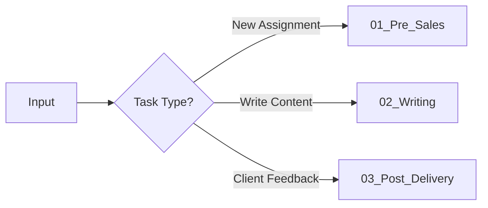

# Academic Writing System (论文写作系统)

> **Type:** Callable Skill Module / Claude Skill
> **Owner:** Asher (Yixuan Zhang)
> **Version:** 1.0 (Framework)

## 🎯 Purpose
End-to-end academic paper writing service workflow, from assignment analysis to final delivery.

---

## 🤖 Agent Capabilities Declaration

| Capability | Status | Description |
|------------|--------|-------------|
| 📄 **File Parsing** | ✅ Required | Read PDF, PPT, DOCX, Excel |
| 🔒 **Strict Step Execution** | ✅ Required | No skipping steps; explicit checkpoint required |
| 📁 **File/Folder Creation** | ✅ Required | Create staging directories for deliverables |
| 🌐 **Web Search** | ✅ Required | Research & citation verification |
| 📊 **Visual Output** | ✅ Required | Python/Mermaid for charts, diagrams |

---

## 📍 Phase Router



| Phase | Trigger | Workflow |
|-------|---------|----------|
| **01_Pre_Sales** | New assignment received | `./01_Pre_Sales/_WORKFLOW.md` |
| **02_Writing** | Pricing confirmed, begin writing | `./02_Writing/_WORKFLOW.md` |
| **03_Post_Delivery** | Client requests revision | `./03_Post_Delivery/_WORKFLOW.md` |

---

## ⚙️ Quality Gates (Global)

> [!IMPORTANT]
> **No Step Skipping.** Agent MUST complete each step and confirm before proceeding.

- [ ] **Step Confirmation:** Agent must explicitly state completion of each step.
- [ ] **Token Budget:** Unlimited for `02_Writing` phase. Precision > Brevity.
- [ ] **Citation Verification:** All academic references must be verified via web search.

---

## 📂 Directory Structure

```
Academic_Writing_System/
├── _SYSTEM.md              # This file (Master Router)
├── 01_Pre_Sales/
│   ├── _WORKFLOW.md        # Assignment analysis workflow
│   └── Templates/          # Pricing/analysis templates
├── 02_Writing/
│   ├── _WORKFLOW.md        # Core writing workflow
│   └── Templates/          # Writing templates
├── 03_Post_Delivery/
│   ├── _WORKFLOW.md        # Revision workflow
│   └── Templates/          # Revision templates
└── Assets/
    └── (Shared resources)
```

---

## 🚀 Invocation Example

```
@Academic_Writing_System: Analyze the assignment in [attached PDF].
```

```
@Academic_Writing_System: Begin 02_Writing for [Project Name].
```
