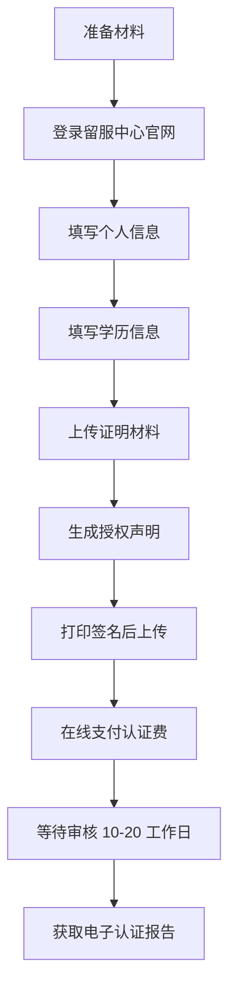

# 1.0 海外学历认证 (CSCSE Degree Verification)

> **模块定位:** 留学归国后办理学历学位认证的完整流程与材料清单。
> **适用场景:** 澳洲/英美/加拿大等国留学生回国后申请中国教育部留服中心认证。

## 核心概念

**留服认证 (CSCSE Verification)** 是由中国教育部留学服务中心 (CSCSE) 对海外学历学位进行官方认可的过程。认证结果是国内就业、考公、落户等场景的必备材料。

## 必备材料清单

| 材料 | 说明 | 优先级 |
|---|---|---|
| **护照首页** | 带照片的生物信息页扫描件 | ⭐⭐⭐ |
| **身份证正反面** | 清晰扫描件或照片 | ⭐⭐⭐ |
| **学位证书 (Testamur)** | 毕业证书扫描件 | ⭐⭐⭐ |
| **成绩单 (Transcript)** | 完整学业成绩单 | ⭐⭐⭐ |
| **证件照** | 符合规格的 2 寸证件照 | ⭐⭐⭐ |
| **出入境记录** | 国家移民管理局 App 下载 | ⭐⭐⭐ |
| **授权声明** | 系统生成，需手写签名 | ⭐⭐⭐ |
| **AHEGS (澳洲)** | 澳洲高等教育毕业声明 | ⭐⭐ |

## 操作流程



## 关键信息填写模板

### 学历信息 (Form Fill)
```text
颁证学校所在地点: 澳大利亚 (Australia)
颁证学校外文名称: [University Name]
学位外文名称: [Degree Name, e.g., Master of Business]
学位层次: 硕士/学士 (Master/Bachelor)
学习专业 (外文): [Major in English]
学习专业 (中文): [Major in Chinese]
学习开始时间: YYYY-MM-DD
学习结束时间: YYYY-MM-DD (以成绩单 "Qualified On" 日期为准)
学号 (Student ID): [Student ID]
学科类别: 管理学/理学/工学... (根据专业选择)
远程修读: 否
```

### 授权声明模板 (中英双语)
```text
# 声明
本人授权及同意中国留学服务中心（CSCSE）使用本人的个人信息和资料...

# Declaration
I, undersigned, hereby give my consent to the Chinese Service Center 
for Scholarly Exchange (CSCSE) to use my personal information...

个人信息: 姓名 | 出生日期 | 学号 | 颁证院校 | 证书名称 | 
         就读专业 | 学习时间 | 身份证号/护照号
```

## 注意事项

> [!IMPORTANT]
> **学习结束时间** 应以成绩单 (Transcript) 上的 "Qualified On" 日期为准，而非学位证上的 "Conferral" 日期。

> [!TIP]
> 出入境记录推荐使用 **国家移民管理局 App/小程序** 下载电子版 PDF，比扫描护照所有页更方便且被官方认可。

> [!WARNING]
> 每个学位需要**单独申请**认证，如有本科+硕士两个学位，需分别提交两份申请。

## 官方资源

- **留服中心官网:** [http://zwfw.cscse.edu.cn/](http://zwfw.cscse.edu.cn/)
- **出入境记录查询:** [https://s.nia.gov.cn/](https://s.nia.gov.cn/)
- **认证结果查询:** 登录留服中心账户查看

## 术语索引

| 术语 | 英文 | 定义 |
|---|---|---|
| 留服认证 | CSCSE Verification | 中国教育部留学服务中心对海外学历的官方认证 |
| Testamur | Degree Certificate | 学位证书/毕业证书 |
| Transcript | Academic Record | 学业成绩单 |
| AHEGS | Australian Higher Education Graduation Statement | 澳洲高等教育毕业声明 |
| Conferral Date | 授予日期 | 学位正式授予的日期 |
| Qualified Date | 修读完成日期 | 完成所有学业要求的日期 |
