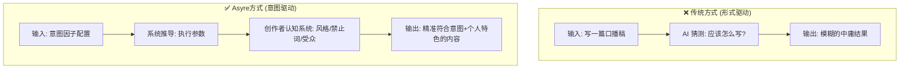
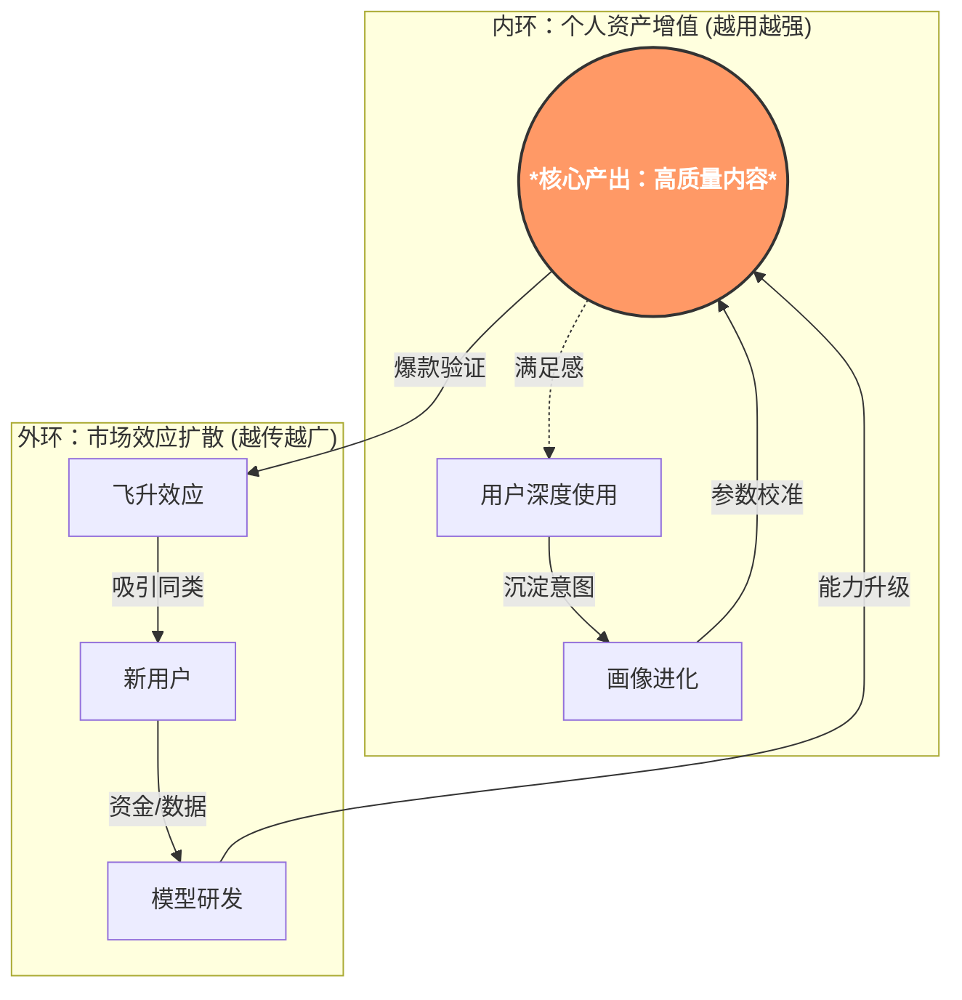

# 飞升创作系统 | 商业计划书 v2.0

> **项目名称:** 飞升创作系统 (Ascension Creation System)
> **产品名称:** Asyre — Asymmetric Content Creation System (非对称内容创作系统)
> **版本:** v2.0
> **日期:** 2026-01-19

---
## 第一章：我们看到的世界

### 1.1 一个正在发生的事实

2024年底，某电商公司裁掉了80%的客服团队。不是因为业务萎缩，而是AI客服的满意度已经超过了人工。

2025年，麦肯锡全球裁员数千人。作为全球顶级咨询公司，他们的分析师——那些年薪百万的精英——正在被AI+少数资深合伙人的组合所替代。

2026年1月，Anthropic发布了Claude的Cowork功能，实现了真正的AI Agent能力。AI不再只是"帮你写东西"，而是可以像员工一样自主完成任务。

**这意味着什么？**

AI已经不是"提高效率的工具"，而是**正在替代人**。

### 1.2 但问题没有那么简单

你可能会想："那我学会用AI不就行了？"

问题是——**大家都会用AI了，但大家都用不明白。**

你用AI写文章，写出来像机器人说话。
你的老板也用AI，但他发现AI根本不懂他想要什么。
你的同事也用AI，写出来的东西千篇一律。

**这就是我们的产品要解决的问题。**

现在的情况是这样的：

| 场景 | 问题 |
|------|------|
| 员工用AI写稿 | 写出来没有个人特色，和别人用AI写的没区别 |
| 老板用AI写brief | AI不懂他真正想表达什么，出来的东西不对味 |
| 团队都用AI | 产出千篇一律，失去了品牌调性 |
| 自媒体用AI | 播放量反而下降，因为AI写的太"AI味"了 |

**问题不是"会不会用AI"，而是"会不会用AI表达自己"。**

这就是Asyre存在的意义——**帮你用AI写出有灵魂的内容**。

### 1.3 我们解决什么问题

回到最开始说的——大家都会用AI，但大家都用不明白。具体表现是什么？

**问题1：不知道说什么**
脑子里有很多想法，但不成体系。想表达，但说不清楚。感觉自己没什么独特的东西可以分享。

**问题2：不知道怎么说**
知道自己想表达什么，但不知道怎么组织语言。写出来的东西自己都觉得平庸。不知道什么是好的内容，什么是差的内容。

**问题3：AI写的不像"我"**
用ChatGPT或Claude写东西，能写出来，但总觉得"不是我的味道"。AI的输出千篇一律，缺乏个人特色。用了AI反而失去了独特性。

**这三个问题的本质是同一件事：**

> 你没有把自己的认知系统外化，AI也不知道你是谁。

**我们的解决方案是：帮你建立一套"外挂系统"。**

这套系统把你的经历、视角、价值观结构化存储，让AI能够读懂它、表达它。这样AI写的东西就不是"通用文章"，而是"你的文章"。

### 1.4 什么是"飞升"？

我们把这个状态转变叫做**"飞升"**——从"被AI比较的人"变成"驾驭AI的人"。

换个角度看：

**传统知识工作者 vs 飞升者**

| 维度 | 传统知识工作者 | 飞升者 |
|------|----------------|--------|
| **知识存储** | 在大脑里，靠记忆 | 在外挂系统里，随时调用 |
| **知识边界** | 个人经验 + 学历 | 理论上是全人类知识 |
| **调用方式** | 回忆 | 查询 + 组合 |
| **核心能力** | 记忆力 | **提问力 + 组织力** |

看出差别了吗？

传统模式下，你得自己"记住"东西。
飞升模式下，你只需要知道**怎么调用**。

就像《钢铁侠》——托尼·斯塔克不是变成了超人，而是穿上了一套能不断迭代的外骨骼。他的肌肉没变强，但他能调动的力量是无限的。

**这就是我们说的"附能"。**

类比萨满"神灵附体"—— 自己不是神，但神可以借自己的身体说话。你不需要记住所有知识，你只需要能调用一个可以替你说话的系统。

**我们的产品就是帮你建立这套"外挂系统"。**

你的经历、你的视角、你的价值观——这些是你的"灵魂"。
我们帮你把这个灵魂结构化、外化，让AI能够读懂它、表达它。
这样，AI写的东西就不是"通用文章"，而是"你的文章"。

飞升不是一个抽象概念，而是一个非常具体的状态转变：

| 状态 | 没飞升 | 飞升后 |
|------|--------|--------|
| **工作方式** | 自己动手写、做、改 | 用AI执行，自己把控方向 |
| **核心竞争力** | 技能（能写、能画、能分析） | 判断力（知道什么是好的） |
| **被替代风险** | 高——技能可被AI复制 | 低——判断力不可复制 |
| **产出效率** | 一天写一篇 | 一天"雕刻"十篇 |
| **独特性** | 取决于经验多少 | 取决于认知深度 |

举两个具体的例子：

**没飞升的内容创作者：**
- 每次发内容都在试水，不知道什么能火
- 偶尔爆了一条，也不知道为什么
- 用AI写的东西千篇一律，一看就是AI味
- 每天都在重复摸索，没有积累、没有系统

**飞升后的内容创作者：**
- 有自己的"外挂系统"记录了所有有效的内容模式
- 知道自己的风格是什么、受众要什么
- AI写的内容听起来就是"他的声音"
- 每一条成功/失败的内容都变成了系统的一部分，越做越清晰

---

**没飞升的企业内容团队：**
- 新人来了要培训3个月才能上手
- 内容质量依赖个别"高手"，走了就没了
- 用AI写东西，但AI不懂公司的调性和产品
- 团队每个人产出的内容风格都不一样

**飞升后的企业内容团队：**
- AI被"喂"了公司的品牌手册、成功案例、产品知识
- 新人第一天就能产出符合品牌调性的内容
- "高手"的能力被沉淀成系统，谁都可以调用
- 内容产出效率翻5倍，质量反而更稳定

---

**这就是"维度跃迁"。**

没飞升的人每天都在重复"第一天"——不断试错，没有积累。
飞升的人每天都在"迭代系统"——每一次成功和失败都变成系统的一部分。

**对于企业来说，这意味着什么？**

传统模式下，你招的每个员工都在"重复第一天"：
- 花3个月培训新人，刚能上手，人走了
- 团队的"高手"离职，带走了他脑子里的经验
- 每个人都在从零开始摸索，公司没有积累

用了我们的系统：
- 团队的成功经验被沉淀成系统，不再依赖个人
- 新人接入系统第一天就能产出高质量内容
- 员工来来走走，但系统只会越来越强

**关键点：这套系统会永远和你一起持续升级。**

不是一次性买个工具就完了。是你用得越久、喂得越多，它就越懂你。

### 1.5 我们的客户是谁

我们服务两类人：

**第一类：内容创作者**

博主、UP主、自媒体人、短视频创作者。

他们的痛点：
- 每次发内容都在碰运气，不知道什么能火
- 偶尔爆了也不知道为什么，下次复制不了
- 用AI写东西没有个人特色，一看就是AI味

我们帮他们解决：
- 建立个人"外挂系统"，把成功模式沉淀下来
- 让AI学会他们的风格、调性、受众偏好
- 每一条内容的反馈都变成系统优化的输入

**第二类：企业内容团队**

需要持续产出内容的公司：新媒体部门、品牌营销、内容运营。

他们的痛点：
- 内容质量依赖个别"高手"，人走了就没了
- 新人培训成本高，3个月才能上手
- 用AI写东西不懂公司调性，产出千篇一律

我们帮他们解决：
- 把公司的品牌手册、成功案例、产品知识喂给系统
- 新人第一天就能产出符合品牌调性的内容
- "高手"的能力被沉淀成系统资产，谁都可以调用

**效果怎么验证？**

对于创作者：播放量、点赞率、完播率——这些数字直接说明问题。
对于企业：内容产出效率、新人上手时间、内容质量一致性——都可以量化。

---

### 1.6 我们的起点

我（Asher）花了大量时间构建自己的"外挂系统"：

- 一个可以自动整理对话、提炼观点的知识图谱
- 一套从无到有生成高质量内容的方法论（意图因子系统）
- 一个可以量化评估内容质量的模型（七层公式）
- 一整套可以和AI协作的工作流

这些东西最初只是我自己用的。

直到有一天，一个做内容的朋友用了我的方法，一周之内播放量翻了好多倍。

他问我：**"这套东西能教给别人吗？"**

我意识到：**这不是我一个人的工具，这是可以帮助所有创作者飞升的系统。**

于是有了这个项目。

吕喆哥加入后，带来了他多年在内容行业的实战经验——他知道创作者真正需要什么，知道什么样的功能是花架子、什么是真正有用的。

这就是我们的起点。

具体来说，飞升意味着：

| 维度 | 没飞升的状态 | 飞升后的状态 |
|------|--------------|--------------|
| **与AI的关系** | 被AI比较、替代 | 把AI当成自己的"机械臂" |
| **能力边界** | 受限于个人脑容量 | 通过外挂系统无限扩展 |
| **输出质量** | 依赖天赋和积累 | 认知系统 × AI放大效率 |
| **竞争优势** | 技能（可被学习） | 独特性（不可复制） |
| **社会定位** | 执行者/被管理者 | 价值创造者/规则定义者 |

**飞升的本质不是有限的"更强"，而是"维度跃迁"。**

就像从二维到三维——在二维世界里的竞争规则，在三维世界里根本不适用。

### 1.3 为什么要去创作？

**这个时代，什么样的内容才能脱颖而出？**

AI可以批量生产内容，但大多数AI写的内容长这样：
- 正确但无聊
- 通顺但没有记忆点
- 什么都说了但什么都没说

**好内容的标准是什么？**

| 维度 | 普通内容 | 优质内容 |
|------|----------|----------|
| **观点** | 人云亦云 | 有独特视角 |
| **表达** | 通顺但平淡 | 有画面感、有记忆点 |
| **共鸣** | 说的是道理 | 说的是"我的感受" |
| **效果** | 看完就忘 | 想点赞、想收藏、想转发 |

**问题来了：怎么既保证内容独特，又保证内容质量？**

这就是我们要解决的核心问题。

**我们的方法：**

1. **把你放大，而不是替代你**
   
   传统AI写作：AI写，人改。结果是AI味很重。
   我们的模式：人的想法、经历、价值观是内核；AI只是帮你表达得更好。

2. **用系统保证质量**
   
   我们有一套"七层质量模型"，量化评估每一篇内容：
   - 可信度够不够？
   - 有没有独特经验支撑？
   - 观点是否鲜明？
   - 表达是否有画面感？
   
   不是凭感觉说"好不好"，而是用数据告诉你哪里可以更好。

3. **让效果说话**
   
   最终检验标准是市场反馈：
   - 播放量涨了吗？
   - 完播率提升了吗？
   - 用户愿意互动吗？

**简单说：我们帮你把内容做得更好，效果看得见。**

---

## 第二章：我们解决什么问题

### 2.1 创作者面临的核心困境

大多数人想创作，但被三座大山挡住了：

**大山一：不知道说什么。**

脑子里有很多想法，但不成体系。想表达，但说不清楚。感觉自己没什么独特的东西可以分享。

**大山二：不知道怎么说。**

知道自己想表达什么，但不知道怎么组织语言。写出来的东西自己都觉得平庸。不知道什么是好的内容，什么是差的内容。

**大山三：AI写的不像"我"。**

用ChatGPT或Claude写东西，能写出来，但总觉得"不是我的味道"。AI的输出千篇一律，缺乏个人特色。用了AI反而失去了独特性。

**这三座大山的本质是同一个问题：**

> **没有把自己的认知系统外化，也没有系统化的创作方法论。**

### 2.2 现有工具的问题

#### 问题一：传统AI助手（ChatGPT/Claude直接对话）

**工作方式：**
```
用户："帮我写一篇关于年轻人不结婚的口播稿"
AI："大家好，今天我们来聊聊年轻人为什么不结婚……"
```

**问题：**
- AI不知道你想达成什么目的——是说服？是共鸣？是宣泄？
- AI不知道你的风格——冷峻？温和？激进？
- AI只能猜测，猜出来的是"中庸"的结果
- 没有质量标准，不知道好坏

**本质缺陷：形式驱动，而非意图驱动。**

#### 问题二：其他AI写作工具

**工作方式：**
```
提供模板 → 用户填空 → AI补全
```

**问题：**
- 模板是通用的，不是为"你"设计的
- 没有考虑你的独特经历和价值观
- 输出的是"符合模板的内容"，而非"符合你的内容"
- 无法帮你建立自己的创作体系

**本质缺陷：标准化生产，抹杀独特性。**

#### 问题三：普通Claude Skill

**什么是Cloud Skills？**
Cloud Skills是近期很火的概念，本质上是把一套工作流程（Workflow）封装成一个自动化指令。比如把"搜索-总结-翻译"封装成一个 `/research` 命令。

**普通Skill的问题在哪里？**

绝大多数Skill是由程序员开发的。

- 程序员懂代码，懂API，懂自动化。
- **但程序员通常不懂认知心理学、不懂传播学、不懂内容创作的底层逻辑。**

所以他们封装出来的Skill，往往只是"工具的堆叠"：
- 能帮你搜得更快
- 能帮你排版更整齐
- 但无法帮你提升**内容的内核**

**我们的护城河：跨学科的系统构建能力**

Asyre不仅仅是一段代码，它是**代码 + 认知科学 + 传播学 + 哲学**的结晶。

- 我们知道如何用**意图因子**解构人类的沟通目的（这是传播学）
- 我们知道如何用**七层质量模型**评估内容价值（这是认知科学）
- 我们知道如何把这些理论变成AI能执行的**参数**（这是系统工程）
- 并且我们还在持续增加新的认知模块：
  - **Hook技术**（注意力经济学）
  - **Human-Like表达**（社会语言学）
  - **飞升世界观**（后人类哲学）

**本质区别：别人在封装指令，我们在封装认知。**

---

## 第三章：我们的解决方案

### 3.1 核心公式

> **内容价值 = 人的不可替代性 × AI的放大效率**

这个公式揭示了AI时代内容创作的本质：

- **人的不可替代性**：你的经历、你的价值观、你的审美、你的判断力
- **AI的放大效率**：无限的语言能力、结构能力、优化能力

两者缺一不可。只有人没有AI，效率太低；只有AI没有人，千篇一律。

**Asyre的定位：让这个乘法的结果最大化。**

### 3.2 Asyre是什么

Asyre是一个**意图驱动的内容创作参数系统**。

#### 传统方式 vs Asyre方式



**核心区别：**

| 维度 | 传统方式 | Asyre方式 |
|------|----------|-----------|
| **驱动因素** | 形式（口播/文章） | 意图（说服/共鸣/颠覆） |
| **参数来源** | AI猜测 | 规则推导 |
| **个人特色** | 无 | 创作者画像系统 |
| **质量标准** | 主观判断 | 七层量化公式 |
| **迭代方式** | 凭感觉改 | 基于评分改 |

### 3.3 Asyre的核心创新

#### 创新一：意图因子系统 (Intent Factor System)

传统方式按"形式"分类——口播稿、长文、短视频脚本。但同样是口播稿，"说服型"和"科普型"的写法完全不同。

Asyre按"意图"分类。我们定义了13个意图因子：

**认知改变类：**
- `concept_clarification` — 概念澄清
- `hidden_reveal` — 信息揭示
- `cognitive_disruption` — 认知颠覆
- `knowledge_transfer` — 知识传递

**态度改变类：**
- `value_guidance` — 价值观引导
- `persuasion` — 观点说服
- `identity_construction` — 身份认同构建

**行为改变类：**
- `action_call` — 行动号召
- `decision_guidance` — 决策引导

**情感满足类：**
- `emotional_resonance` — 情感共鸣
- `emotional_catharsis` — 情绪宣泄
- `entertainment` — 娱乐消遣
- `validation` — 认知验证

**每篇内容是多个意图因子的加权组合。** 就像化学元素一样，不同元素的组合会产生完全不同的化合物。

#### 创新二：参数推导引擎 (Parameter Derivation Engine)

意图因子会自动推导出执行参数：

```
意图因子量化 → 规则匹配 → 参数推导 → 执行规则生成
```

例如，当"说服"因子权重高时，系统自动推导：
- `attitude_strength` → 高（立场必须鲜明）
- `fence_sitting_tolerance` → 低（禁止骑墙）
- 执行规则 → 禁止"一方面...另一方面..."句式

**这不是模板，是动态推导。** 每个创作任务都会得到独特的参数配置。

#### 创新三：七层质量公式 (7-Layer Quality Formula)

内容质量不再是"感觉好不好"，而是可量化的：

```
Q = T_gate × Σ(wi × Fi)
```

七层因子：

| 层级 | 因子 | 含义 | 护城河强度 |
|------|------|------|------------|
| **门槛层** | T (可信度) | 内容是否可信 | ★★★★★ |
| **护城河层** | E (经验+专业) | 独特经验/专业深度 | ★★★★★ |
| **护城河层** | C (深度判断) | 独特视角/洞察力 | ★★★★★ |
| **放大器层** | F (受众匹配) | 是否切中目标受众 | ★★★ |
| **放大器层** | D (表达) | 语言/结构是否精彩 | ★★ |
| **放大器层** | A (执行) | 技术细节是否到位 | ★ |
| **放大器层** | B (时机) | 发布时机是否合适 | ★ |

**关键洞察：护城河因子由人决定，放大器因子可被AI优化。**

如果你的E和C层很弱（没有独特经验和判断），AI再怎么优化D和A层，内容也只是"技术精湛的平庸"。

#### 创新四：创作者画像系统 (Creator Profile System)

每个创作者有自己的"画像"：

```json
{
  "creator_profile": {
    "intent_factors": {
      "value_guidance": 8,
      "persuasion": 9,
      "cognitive_disruption": 9
    },
    "style": {
      "tone": "冷峻黑客风",
      "forbidden_words": ["大家好", "众所周知"],
      "structure_rules": ["三点法则", "3秒核心信息"]
    },
    "target_audience": {
      "iq_threshold": "high",
      "filter_stupidity": true
    }
  }
}
```

**这意味着：AI不是在写"通用内容"，而是在写"你的内容"。**

更重要的是，**这个画像是会"自动进化"的**：

- **方式一：通过对话进化**
  系统会主动向你提问："你如何看待这种观点？"、"你最讨厌什么？"。
  通过这些直击灵魂的哲学问题，AI在不断完善对你价值观的理解。
  
- **方式二：通过内容进化**
  系统会分析你过去发的所有内容、写过的评论。
  "原来你喜欢用短句"、"原来你反感这种套路"。
  
**你写得越多，AI越懂你；AI越懂你，你的一键生成越精准。**

传统AI写作是"拼凑"——从零开始堆积材料。
Asyre的理念是"雕刻"——先快速产出"石头"，再把不要的部分删掉。

六阶段流程：
1. **意图解析** — 分析主题的意图因子组合
2. **参数推导** — 输出关键参数（作为启发，不是约束）
3. **自由创作** — 带着方向感自由发挥，**初稿即高质量**
4. **评价文档** — 七层质量公式评分，标记短板
5. **雕刻修正** — 去冗余（10-20%）
6. **精修审核** — 质量提升轨迹报告

**雕刻能删废话，但雕刻不出灵魂。所以初稿就要有灵魂。**

### 3.4 为什么只有我们能做

> **差异化 = 经历 × 价值观 × 审美**

#### 原因一：系统来自真实的飞升经验

Asyre不是一个"产品想法"，而是创始人**自己用来飞升的系统**。

创始人Asher花了大量时间构建：
- 完整的个人知识图谱（AntiGravity + 3D Knowledge Graph）
- 系统化的内容创作方法论（Hook技术、Intent Factor、Human-Like表达）
- 哲学层面的世界观支撑（飞升世界观、化身论）
- **效率维度的突破性尝试：论文写作工作流**
  （他在辅导留学生时开发了一套备受好评的论文写作工作流，打破了搜索整理的封锁，把正常需要1-2周的论文工作量压缩到2小时完成）

**这不是设计出来的产品，是用出来的系统。**

#### 原因二：跨学科的底层逻辑

Asyre不是"程序员写的代码"，而是**"科学家构建的系统"**。

创始人将生物化学的**系统论思维**（System Thinking）与**人文科学**深度融合：

1.  **第一性原理 (First Principles & Neuroscience)**
    -   借鉴神经科学：将复杂的创作过程解构为不可再分的"原子意图"（Intent Factors）。
    -   就像化学元素组合出万物，我们用13个意图因子组合出所有类型的内容。

2.  **古典修辞学 (Classical Rhetoric)**
    -   复用了亚里士多德甚至更早的智慧：PIE模型（Persuade/Inform/Entertain）和三大诉求（Logos/Pathos/Ethos）。
    -   这保证了我们的逻辑在几千年的尺度上都是有效的。

3.  **认知科学 (Cognitive Science)**
    -   引入精细加工可能性模型（ELM）：区分"中心路径"（讲道理）和"外围路径"（讲情绪），让AI知道什么时候该煽情，什么时候该讲理。

4.  **行为经济学 (Behavioral Economics)**
    -   引入"助推"（Nudge）理论：把影响力设计在每一个文字细节里，潜移默化地影响读者。

**这种"自然科学的严谨系统" + "人文科学的艺术表达"，构成了我们极高的竞争壁垒。**

**但它又不只是学术——它被提炼成了可执行的参数系统。**

#### 原因三：有"灵魂"层面的差异

普通工具只有"术"——帮你写得更好。
Asyre有"术"也有"道"——帮你飞升。

**术：** 意图推导、参数配置、质量评分、迭代优化
**道：** 帮助你成为更好的自己、表达你的独特性、获得同类认可

**只有术的工具，别人可以复制。有道的系统，只有我们能做。**

---

## 第四章：我们服务谁

### 4.1 客户优先级

#### 第一优先级：内容创作者

**画像：**
- 自媒体博主、UP主、公众号作者
- 有内容输出需求，但创作能力不足
- 已经在用AI，但对结果不满意

**痛点：**
- 内容没有个人特色
- 不知道怎么提升质量
- 播放量/阅读量不稳定

**我们解决的问题：**
- 帮助建立个人创作体系
- 通过意图因子匹配内容定位
- 通过七层公式诊断和优化

**成功指标：**
- ✅ 播放量提升
- ✅ 点赞/收藏/完播率提高
- ✅ 形成稳定的个人风格

**为什么优先服务他们：**
- 效果可量化（播放数据直接反馈）
- 成功案例可作为信用背书
- 群体数量大，口碑传播快

#### 第二优先级：企业用户

**画像：**
- 需要内容生产的公司（新媒体、营销、品牌）
- 有内容团队，但产出质量不稳定
- 想建立内容SOP，但缺乏方法论

**核心价值：能力复制与降维打击**

我们不仅仅是提供工具，而是**复制核心员工的能力**：
- **提取高手模型**：把公司里最厉害的那个人的经验（或者老板自己的风格）提取出来，变成AI模型。
- **赋能普通员工**：让刚入职的实习生，用这个模型，也能写出接近高手水平的内容。
- **资产沉淀**：员工会离职，但模型永远留在公司。

**痛点解决：**
- 摆脱对个别"大神"的依赖
- 让普通员工拥有创始人级别的内容输出能力
- 新人培训从"教几个月"变成"给个账号"

**成功指标：**
- ✅ 内容产出效率提升
- ✅ 质量标准统一（任何人都有最强者的能力）
- ✅ 新人上手时间缩短

**为什么优先服务他们：**
- 客单价高，利润可观
- 企业付费意愿强
- 可做成标准化培训产品

#### 第三优先级：普通大众

**核心定位：系统进化的受益者**

我们在服务创作者和企业的过程中，系统会不断"排泄"（输出）两样东西：
- **核心方法论**：怎么思考、怎么拆解问题
- **实用小技能**：怎么用AI解决具体的生活/工作难题

**解决什么问题？**
- 消除**"工具焦虑"**：大家都在焦虑不会用AI，我们直接给现成的"思考模版"
- 提供**"生活外挂"**：不仅仅是写文章，更是用AI处理生活琐事

**商业价值：**
- 这些"排泄物"本身就是极佳的自媒体内容
- 我们用这些内容做自媒体账号，获取巨大的流量
- 流量反哺给核心业务，或者转化成低客单价的知识付费产品

---

## 第五章：产品矩阵与路径

### 5.1 产品发展路径

```
Phase 1: Cloud Skill升级 & 数据闭环
    │
    ├── Asyre v3.0（最先进模型）
    ├── 创作者画像系统完善
    ├── **多平台API接入**（当前进度70%）：
    │   └── 调动各平台接口获取真实反馈数据（播放/点赞/评论）
    └── **反馈学习系统**（当前进度70%）：
        └── 让系统根据数据反馈自动进化
    
Phase 2: 独立产品
    │
    ├── SaaS网站（知识图谱+创作平台）
    ├── 移动App（碎片化创作）
    └── API接口（企业集成）
    
Phase 3: 培训变现
    │
    ├── 公开课（方法论教学）
    ├── 企业培训（定制化）
    └── 认证体系（内容策略师）
```

### 5.2 产品形态详解

#### 产品一：定制化 Claude Skill（当前核心现金流）

**形态：** 为主播/企业定制的专属Skill
**核心价值：** 
- **极速迭代**：目前效能最强，更新速度最快
- **深度定制**：完全贴合客户的业务流
- **即插即用**：直接集成在Claude生态

**定价：** **¥5,000 - ¥30,000 / 单**
（取决于定制深度。因为能极大提升效能，客户完全买单。）

#### 产品二：原生SaaS平台（核心壁垒）

**形态：** 具备原生能力的知识管理与创作平台
**核心底座：** 
- **成熟的知识图谱技术**（已完成验证）
- **原生AI能力加持**（不仅仅是调API，而是系统级融合）

**商业模式：**
- **个人订阅**：高级创作功能 + 知识图谱托管
- **企业订阅**：团队协作 + 资产沉淀 + 私有化部署
- **增值服务**：行业模型包、专家咨询

#### 产品三：企业解决方案

**形态：** 私有化部署 + 培训服务
**功能：**
- 企业知识库集成
- 团队画像管理
- 内容质量审核系统
- 培训课程包

**定价：** 
- **部署费：** ¥20,000 - ¥30,000 (一次性)
- **年费：** ¥10,000 / 年 (维护与升级)

#### 产品四：公开课与培训

**形态：** 录播课程 + 直播培训
**核心课程体系：**
- **初阶（录播）：** 《如何用AI写出有灵魂的内容》
  - 包含：意图因子基础、7层质量自检、常用Prompt模版
- **高阶（直播/线下）：** 《构建你的第二大脑》
  - 包含：个人知识图谱构建、独特方法论提取、私有化工作流搭建

**定价：** 
- **录播单课：** ¥299 (引流款)
- **深度培训：** ¥10,000+ (高客单)

### 5.3 增长飞轮

### 5.3 增长飞轮：为什么我们会越来越强？

这不是一个简单的"用户增长"模型，而是一个**"价值滚雪球"**模型。



**这个飞轮揭示了两个巨大的潜力：**

1.  **极高的迁移成本（护城河）：**
    用户用的越久，系统积攒的"个人意图参数"越多，AI就越像他。他根本离不开Asyre，因为换个工具就是"脑叶切除"。

2.  **自带流量的验证机制：**
    我们的用户（创作者）本身就是流量节点。他们一旦成功，就是Asyre最好的广告。**我们不需要买流量，我们的用户在帮我们制造流量。**

---

## 第六章：哲学基石

### 6.1 飞升世界观（核心理念）

**我们相信什么？**

| 核心理念 | 通俗解释 | 产品体现 |
|------|------|----------|
| **每个人都无可替代** | AI很强，但它没有你独一无二的人生体验 | 挖掘并放大用户的个人特质 |
| **越分享越强大** | 藏着掖着没用，把方法教给别人，你才是宗师 | 鼓励用户将自己的Prompt和模型分享出去 |
| **失败也是资产** | 每次试错都是在给系统喂数据，失败越快，进化越快 | 让用户看到"错误内容"背后的迭代价值 |
| **互补才能共赢** | 承认自己做不到某些事，用AI来补短板 | Asyre充当用户的全能助手 |

### 6.2 产品的"道"

> "真正的强大，不是把自己变成机器，而是指挥机器去服务人类。"

普通工具的目的是让你**省时间**。
Asyre的目的是帮你**建立影响力**。

**我们不是在卖写作软件，我们是在卖"未来的生存权"。**
在AI时代，要么你被AI淹没，要么你驾驭AI去发声。Asyre就是那个让你发声的扩音器。

---

## 第七章：发展阶段

### Phase 1: 核心能力构建与变现（Current）

**重心：** 定制Skill交付 + 核心模块完善

| 任务 | 当前进度 | 关键目标 |
|------|------|----------|
| **反馈学习系统** | 🔄 70% | 完成闭环，让系统能根据数据自我进化 |
| **多平台API接入** | 🔄 开发中 | 打通各平台数据，获取真实反馈 |
| **定制Skill交付** | ✅ 进行中 | 服务头部客户，跑通商业闭环，积累现金流 |

### Phase 2: 独立SaaS平台（Next Step）

**重心：** 知识图谱成熟 + 原生平台上线

| 任务 | 计划 | 关键目标 |
|------|------|----------|
| **SaaS平台Beta** | 2026 Q2 | 提供比Claude原生更强的知识管理体验 |
| **知识图谱可视化** | 2026 Q2 | 让用户"看见"自己的思维结构 |
| **移动端App** | 2026 Q3 | 随时随地捕捉灵感，碎片化创作 |

### Phase 3: 生态与规模化（Future）

**重心：** 行业标准 + 平台生态

| 任务 | 规划 | 关键目标 |
|------|------|----------|
| **认证体系** | 2026 Q4 | 建立"内容策略师"行业标准 |
| **企业私有化** | 2027 | 成为企业的"AI内容中台" |
| **Asyre Store** | 2027 | 用户可以买卖自己的Prompt和模型 |

---

## 第八章：团队与资源

### 8.1 核心团队

**创始人/产品：张毅轩 (Asher)**

**教育背景：**
- **硕士** (2023-2025): Monash University - 商业（创业学 + 全球商务）
- **学士** (2020-2022): Monash University - 理学（生物化学）

**核心优势：跨领域融合 (生物化学 + 商业策略)**
"理科思维"拆解系统，"商科视角"构建模式。
- **跨领域整合者**：将神经科学、商业策略、哲学思考融合成系统
- **系统构建者**：已有个人外挂系统 (AntiGravity) + 完整方法论 (意图因子/七层模型) + 哲学世界观 (飞升)

**联合创始人：吕喆 (Lü Zhé)**

**背景：** 资深内容创作者、连续创业者、行业意见领袖
- **内容判断力**：能快速识别什么内容能火
- **市场嗅觉**：深刻理解创作者痛点
- **资源网络**：拥有广泛的MCN与头部创作者资源

**角色：** 市场策略、早期验证、影响力变现

### 8.2 核心资产

| 资产 | 状态 | 说明 |
|------|------|------|
| Asyre v2.9 | ✅ 已有 | 核心产品，持续迭代中 |
| Intent Factor System | ✅ 已有 | 13因子+完整推导规则 |
| 七层质量模型 | ✅ 已有 | 可量化评估体系 |
| 创作者画像系统 | ✅ 已有 | 6维画像模板 |
| Hook技术库 | ✅ 已有 | 8大钩子类型 |
| Human-Like表达 | ✅ 已有 | 反AI写作方法论 |
| 飞升世界观 | ✅ 已有 | 产品灵魂支撑 |

---

## 第九章：签名

我们不只是在做一个产品，我们是在**定义AI时代人该怎么活**。

谁先提出概念、传播概念，谁就抢占定义权。
谁能帮助更多人飞升，谁就是这个时代的先行者。

---

> **签名:** Asher 
> **日期:** 2026-01-19
> **BP版本:** v2.0

---

## 附录：系统关联

**哲学基石:**
- [Ascension_Worldview](file:///Users/yixuanzhang/Library/Mobile%20Documents/com~apple~CloudDocs/工作/修荷/Asher_Source_Profile_v1/02_Skill_Tree/Modules/Philosophy/Ascension_Worldview/Ascension_Worldview.md)

**产品系统:**
- [Asyre](file:///Users/yixuanzhang/Library/Mobile%20Documents/com~apple~CloudDocs/工作/修荷/Asyre/Asyre/)

**方法论模块:**
- [Enterprise_Operation_System](file:///Users/yixuanzhang/Library/Mobile%20Documents/com~apple~CloudDocs/工作/修荷/Asher_Source_Profile_v1/02_Skill_Tree/Modules/Enterprise_Operation_System/)

### 思想渊源 (Intellectual Origins)

本系统的底层逻辑致敬并引用了以下著作的核心思想，它们共同构成了 Asyre 的理论地基：

#### 1. 哲学与神学 (Philosophy & Theology)
*探索存在的终极意义与人类精神的归宿*

1.  **《道德经》 (Tao Te Ching)** - 老子: *引用"反者道之动"思想，作为飞升系统"利他即利己"的增长原动力。*
2.  **《查拉图斯特拉如是说》 (Thus Spoke Zarathustra)** - 尼采: *引用"超人"(Übermensch)概念，定义飞升者打破旧价值体系的勇气。*
3.  **《薄伽梵歌》 (Bhagavad Gita)**: *引用"Karma Yoga"(行动瑜伽)，确立"只管行动，不执着于果"的创作心态。*
4.  **《人的现象》 (The Phenomenon of Man)** - 德日进: *引用"心智圈"(Noosphere)概念，预言人类意识通过网络连接形成超级有机体。*
5.  **《沉思录》 (Meditations)** - 马可·奥勒留: *引用斯多葛学派的"内在城堡"概念，在混乱的各种信息流中保持创作定力。*
6.  **《纯粹理性批判》 (Critique of Pure Reason)** - 康德: *引用"先验图式"概念，作为Asyre知识图谱构建的认识论基础。*

#### 2. 进化论与复杂系统 (Evolution & Complexity)
*理解生命、信息与宇宙的演化规律*

7.  **《失控》 (Out of Control)** - 凯文·凯利: *引用"去中心化"与"涌现"智慧，作为创作者生态自组织的理论依据。*
8.  **《自私的基因》 (The Selfish Gene)** - 理查德·道金斯: *引用"模因"(Meme)作为文化传播最小单位的概念，指导"意图因子"的设计。*
9.  **《系统之美》 (Thinking in Systems)** - 德内拉·梅多斯: *引用"反馈回路"原理，设计Asyre的增长飞轮与质量控制系统。*
10. **《反脆弱》 (Antifragile)** - 纳西姆·塔勒布: *引用"从混乱中获益"的思想，指导用户利用负面反馈进行迭代进化。*
11. **《规模》 (Scale)** - 杰弗里·韦斯特: *引用生物体与城市的生长法则，预测Asyre网络效应的指数级增长。*
12. **《无穷的开始》 (The Beginning of Infinity)** - 大卫·多伊奇: *引用"知识创造"是无限过程的观点，反对封闭系统，拥抱开放式进化。*
13. **《哥德尔、艾舍尔、巴赫》 (GEB)** - 侯世达: *引用"怪圈"与"自指"概念，探索AI如何协助人类产生自我意识的飞跃。*

#### 3. 认知科学与心理学 (Cognitive Science & Psychology)
*解构人类大脑的运作机制与局限*

14. **《思考，快与慢》 (Thinking, Fast and Slow)** - 丹尼尔·卡尼曼: *引用"系统1与系统2"理论，优化Prompt设计以平衡直觉与逻辑。*
15. **《助推》 (Nudge)** - 理查德·泰勒: *引用行为经济学，通过"选择架构"的设计引导用户自然完成高难度创作。*
16. **《心流》 (Flow)** - 米哈里·契克森米哈赖: *引用"最优体验"理论，致力于让用户在使用Asyre时进入忘我的创作状态。*
17. **《大脑的两个半球》 (The Master and His Emissary)** - 伊恩·麦吉尔希里斯特: *引用左右脑分工理论，强调AI（左脑逻辑）应服务于人类（右脑整体）。*
18. **《影响力》 (Influence)** - 罗伯特·西奥迪尼: *引用六大说服原理，植入"Hook技术库"以增强内容的传播力。*
19. **《行为》 (Behave)** - 罗伯特·萨波斯基: *从神经生物学角度解析人类行为动机，优化意图因子的生物学底层。*

#### 4. 未来学与媒介理论 (Futurism & Media Theory)
*预判技术如何重塑社会与人类本身*

20. **《有限与无限的游戏》 (Finite and Infinite Games)** - 詹姆斯·卡斯: *引用"无限游戏"视角，将Asyre定义为延续文明对话的平台。*
21. **《理解媒介》 (Understanding Media)** - 马歇尔·麦克卢汉: *引用"媒介即讯息"与"人的延伸"理论，将Asyre定义为"大脑的外挂延伸"。*
22. **《拟像与仿真》 (Simulacra and Simulation)** - 鲍德里亚: *探讨超真实(Hyperreality)时代，如何利用数字分身维持人类的真实性。*
23. **《奇点临近》 (The Singularity is Near)** - 雷·库兹韦尔: *引用技术加速回报定律，定位Asyre为迎接奇点时代的生存工具。*
24. **《人类简史》 (Sapiens)** - 尤瓦尔·赫拉利: *引用"虚构故事"并未人类合作基石的观点，强调"定义权"的重要性。*
25. **《从0到1》 (Zero to One)** - 彼得·蒂尔: *引用"垄断"与"幂次法则"，指导Asyre在AI应用层建立非对称竞争优势。*
