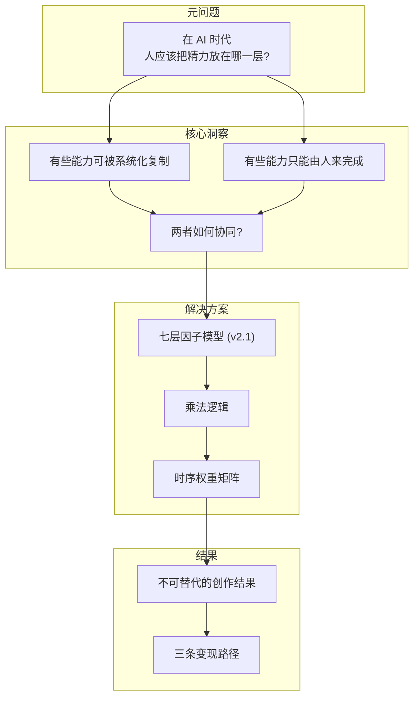
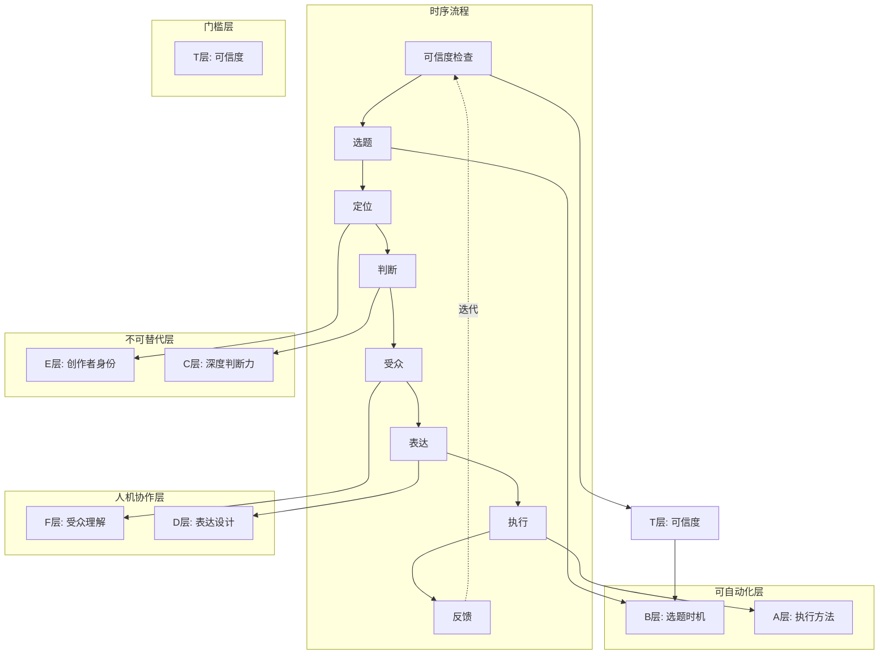
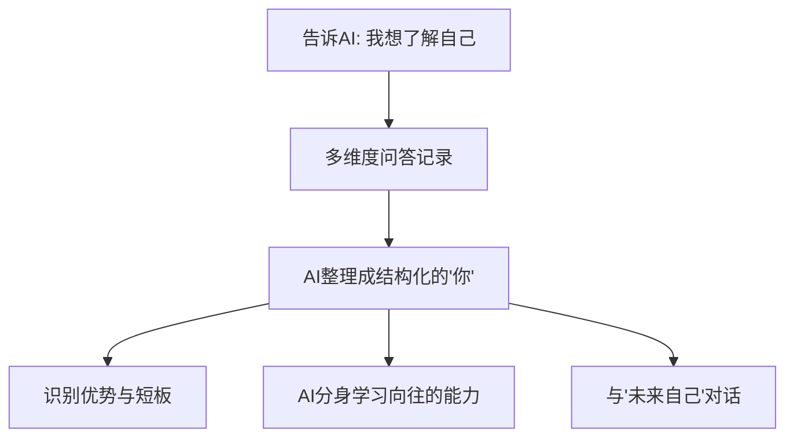
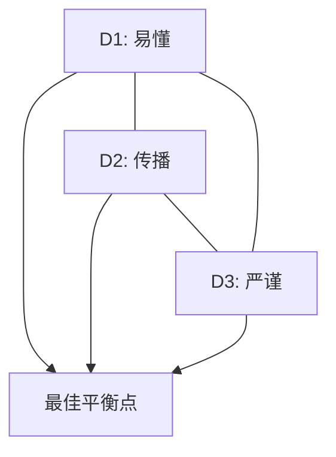
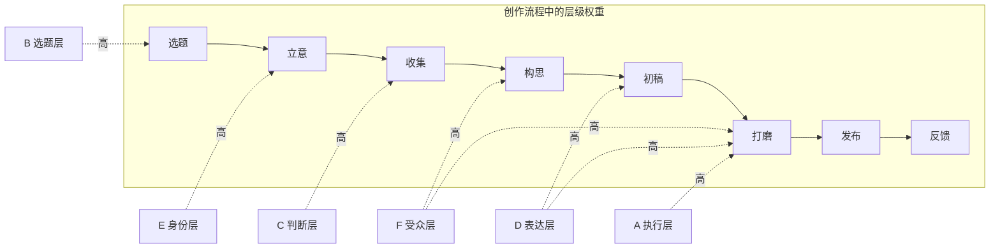
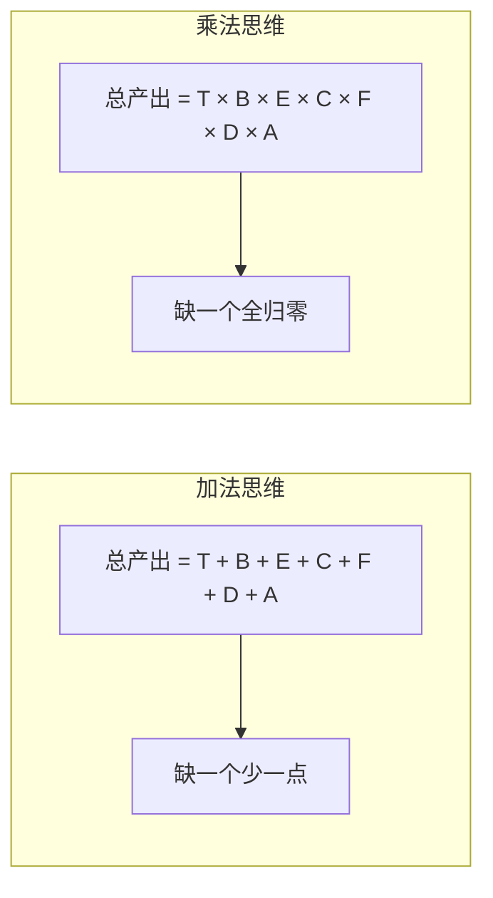
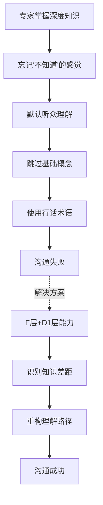
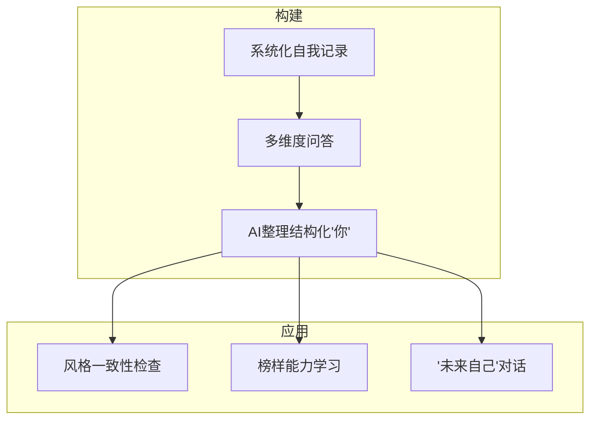

# Content Creation OS - 知识整合文档

> **整合来源:**
>
> - `Asyre_Project_Summary.md`
> - `Asyre_Fact_Check_Report.md`
>
> **最后更新:** 2026-01-12
> **版本:** v2.1 (七层模型)
> **总字数:** ~14,000 字
> **视觉化:** 22 个

---

## 导读 (Executive Summary)

这套体系回答了一个核心问题: **在 AI 时代，人到底该把精力放在哪一层，才能永远不被替代？**

### 双视角框架

本模型提供两个互补的视角来理解高质量内容：

**视角一: 质量公式 (审美评估)** — 一个作品"为什么好"
**视角二: 创作流程 (执行路径)** — 一个作品"怎么写出来"

---

### 视角一: 质量公式 v2.1 (事实核查版)

**核心公式:**

```
Q = T × E × C × F × D × A × B
```

**简化模型:**

```
内容价值 = 可信度 × 护城河 × 放大器

可信度 (T) = 一切的前提，为0则全归0
护城河 (E×C) = 人的不可替代区（经验+判断）
放大器 (F×D×A×B) = 人机协作+自动化区
```

**七因子详解 (含子因子拆分):**

#### T (Trustworthiness/可信度) — 门槛层

```
T = 准确性 × 透明度 × 来源可靠性
```

| 子因子 | 英文 | 说明 | 参数范围 |
|:-------|:-----|:-----|:---------|
| **准确性** | Accuracy | 事实陈述是否正确无误 | 0-1 |
| **透明度** | Transparency | 是否公开信息来源和立场 | 0-1 |
| **来源可靠性** | Source Reliability | 引用来源是否权威可信 | 0-1 |

> 来源: Google E-E-A-T 框架 (2024最重要元素)
> 作用: 作为"乘法门槛"，T≈0则全盘归零

---

#### E (Experience + Expertise) — 护城河

```
E = 第一手经验 × 专业深度 × 风格辨识度
```

| 子因子 | 英文 | 说明 | 参数范围 |
|:-------|:-----|:-----|:---------|
| **第一手经验** | Firsthand Experience | 是否有亲身体验/实践 | 0-1 |
| **专业深度** | Expertise Depth | 领域专业知识积累程度 | 0-1 |
| **风格辨识度** | Voice Distinctiveness | 风格是否可识别为"你" | 0-1 |
| **态度强度** | Attitude Strength | 观点立场是否鲜明 | 0-1 |
| **价值观清晰度** | Value Clarity | 价值观是否一贯明确 | 0-1 |

> 来源: E-E-A-T 中的 Experience + Expertise
> 对应: 自我认知 + 内化的他人优点

---

#### C (Content Depth) — 护城河

```
C = 资料质量 × 跨域关联 × 原创洞察
```

| 子因子 | 英文 | 说明 | 参数范围 |
|:-------|:-----|:-----|:---------|
| **资料质量** | Source Quality | 引用资料的权威性和深度 | 0-1 |
| **跨域关联** | Cross-Domain Links | 跨领域知识连接能力 | 0-1 |
| **原创洞察** | Originality | 是否有独特视角/观点 | 0-1 |
| **洞察密度** | Insight Density | 单位篇幅内的信息价值 | 0-1 |

> 来源: 信息素养研究 (Information Literacy)
> 关键: AI无法判断"什么值得被尊重"，这是人的降维打击区域

---

#### F (Fit/Audience Match) — 放大器

```
F = 认知匹配 × 情绪契合 × 圈层适配
```

| 子因子 | 英文 | 说明 | 参数范围 |
|:-------|:-----|:-----|:---------|
| **认知匹配** | Cognitive Match | 内容难度与受众知识水平匹配度 | 0-1 |
| **情绪契合** | Emotion Alignment | 内容情绪与受众当前状态契合度 | 0-1 |
| **圈层适配** | Tribe Adaptation | 语言风格与受众文化圈层契合度 | 0-1 |
| **目标知识水平** | Target Knowledge Level | beginner/intermediate/advanced | enum |
| **注意力时长** | Attention Span | short/medium/long | enum |

> 来源: 内容营销研究 (受众理解占成功因素82%)
> 解决: 知识的诅咒 (Curse of Knowledge)

---

#### D (Delivery/表达) — 放大器

```
D = D1(实用价值) × D2(传播因子) × D3(严谨性)
```

| 子层 | 子因子 | 英文 | 说明 | 来源 |
|:-----|:-------|:-----|:-----|:-----|
| **D1** | 实用价值 | Practical Value | 内容对受众有多实用 | STEPPS |
| **D2** | 社交货币 | Social Currency | 分享能让人显得聪明/有品味 | STEPPS |
| **D2** | 情绪唤醒 | Emotion Arousal | 触发高唤醒情绪(敬畏/愤怒/焦虑) | STEPPS |
| **D2** | 故事整合 | Story Integration | 核心信息是否嵌入故事载体 | STEPPS |
| **D3** | 严谨性 | Rigor | 简化表达是否保持事实准确 | E-E-A-T |

> 公式: D1 = STEPPS.Practical_Value
> 公式: D2 = Social_Currency × Emotion × Story (STEPPS框架)
> 公式: D3 = E-E-A-T.Trustworthiness (表达层)

---

#### A (Amplification) — 放大器

```
A = 执行技巧 × 平台适配 × 算法理解
```

| 子因子 | 英文 | 说明 | 参数范围 |
|:-------|:-----|:-----|:---------|
| **钩子强度** | Hook Intensity | 开头吸引力强度 | 0-1 |
| **平台适配** | Platform Adaptation | 内容格式对平台规则的适配 | 0-1 |
| **算法理解** | Algorithm Understanding | 了解推荐算法工作逻辑 | 0-1 |
| **口语化权重** | Oral Language Weight | 口语vs书面语比例 | 0-1 |
| **结构类型** | Structure Type | climax_first/pyramid/step_by_step | enum |
| **节奏** | Pacing | fast/medium/slow/varied | enum |

> 来源: 注意力经济 + 平台推荐算法研究
> 性质: 可自动化，但快学快过时

---

#### B (Buzz/时机) — 放大器

```
B = 热度 × 争议度 × (1-风险) × 时效衰减
```

| 子因子 | 英文 | 说明 | 参数范围 |
|:-------|:-----|:-----|:---------|
| **热度指数** | Heat Score | 话题当前的讨论热度 | 0-1 |
| **争议度** | Controversy Index | 话题引发讨论/对立的潜力 | 0-1 |
| **政策安全** | Policy Safety | 触碰红线风险 (1-风险) | 0-1 |
| **时效衰减** | Time Decay Factor | 话题热度的衰减速度 | 0-1 |
| **时效性** | Timeliness | 与当前时间节点的关联度 | 0-1 |

> 来源: 病毒传播研究
> 性质: 实时变量，工具可处理

---

**乘法逻辑:** 任何一个因子为零，整体产出归零。这是残酷性，也是差异化的机会。


---

### 视角二: 创作流程 (执行路径)

把创作能力按流程分成七层（含T层基线）：

| 阶段     | 层级 | 问题              | 性质     | 公式因子 |
| :------- | :--- | :---------------- | :------- | :------- |
| **前置** | T层  | Is it True (真实吗) | 门槛 | Trustworthiness |
| **选题** | B层  | When (什么时候说) | 可自动化 | Buzz |
| **定位** | E层  | Who (谁在说)      | 不可替代 | Experience+Expertise |
| **判断** | C层  | What (说什么)     | 不可替代 | Content Depth |
| **受众** | F层  | For Whom (说给谁) | 人机协作 | Fit/Audience Match |
| **表达** | D层  | How (怎么说)      | 人机协作 | Delivery |
| **执行** | A层  | Execute (执行)    | 可自动化 | Amplification |

---

### 七层定义速查 (对应 Q = T × E × C × F × D × A × B)

- **T层 - 可信度 (Trustworthiness):** 一切的前提。准确性 × 透明度 × 来源可靠性。来源于 Google E-E-A-T 框架，是2024年内容质量最重要的元素。T≈0 则整体归零。

- **B层 - 选题时机 (Buzz):** 判断话题的热度、争议度、时效性和政策风险。公式: 热度 × 争议度 × (1-风险) × 时效衰减。可通过工具和API自动化。

- **E层 - 创作者身份 (Experience + Expertise):** 第一手经验 × 专业深度 × 风格辨识度。来源于 E-E-A-T 框架，对应自我认知 + 内化的他人优点。这是作品的灵魂，不可被替代。

- **C层 - 深度判断力 (Content Depth):** 资料质量 × 跨域关联 × 原创洞察。来源于信息素养研究。AI无法判断"什么值得被尊重"，这是人的降维打击区域。

- **F层 - 受众理解 (Fit/Audience Match):** 认知匹配 × 情绪契合 × 圈层适配。内容营销研究显示受众理解占成功因素82%。解决"知识的诅咒"问题。

- **D层 - 表达设计 (Delivery):** 拆分为三个子层：
  - D1 门槛降解 = STEPPS.Practical_Value (实用价值)
  - D2 病毒包装 = STEPPS.(Social_Currency × Emotion × Story)
  - D3 严谨保持 = E-E-A-T.Trustworthiness (表达层)

- **A层 - 执行方法 (Amplification):** 执行技巧 × 平台适配 × 算法理解。来源于注意力经济和平台推荐算法研究。可自动化，但快学快过时。

### 层级性质分类

- **门槛层 (T):** 可信度是一切的前提，为0则全归0
- **护城河 (E/C):** 人的不可替代区（经验+判断）
- **放大器 (F/D/A/B):** 人机协作+自动化区

---

## 一、核心逻辑链



---

## 二、七层因子模型 (v2.1)

### 模型演进说明

> [!IMPORTANT]
> **v2.1 主要变更:**
>
> 1. **新增T层** — 可信度(Trustworthiness)作为乘法门槛
> 2. **B层前置** — 选题时机应在创作流程最前端
> 3. **新增F层** — 受众理解层，连接"说什么"和"怎么说"
> 4. **D层拆分** — 门槛降解/病毒包装/严谨保持 分开定义
> 5. **时序绑定** — 各层与创作阶段明确关联

---

### 完整架构图



---

### T层: 可信度 (Trustworthiness) [v2.1 新增]

| 属性                 | 描述                                             |
| :------------------- | :----------------------------------------------- |
| **定位**       | 一切的**前置门槛**，决定内容是否可信 |
| **性质**       | 乘法门槛，T≈0则整体归零                     |
| **来源**       | Google E-E-A-T 框架 (2024最重要元素)                     |

〔核心公式〕

```
T = 准确性 × 透明度 × 来源可靠性
```

---

### B层: 选题时机 (Buzz)

| 属性                 | 描述                                             |
| :------------------- | :----------------------------------------------- |
| **定位**       | 创作流程的**第一步**，决定"什么时候说什么" |
| **性质**       | 实时变化的外部变量，可工具化                     |
| **自动化程度** | ★★★★★                                       |
| **护城河强度** | ★                                               |

〔核心功能〕

- **热度判断:** 这个话题现在有没有人关心？
- **争议度评估:** 能否引发讨论？
- **风险过滤:** 会不会触碰红线？
- **时效把握:** 现在说还是等一等？

〔公式〕

```
选题价值 = 讨论热度 × 情绪张力 × 平台权重 × (1 - 政策风险) × 时间衰减系数
```

〔参数化〕

```json
{
  "B_Timing": {
    "controversy_index": 0.6,       // 争议度 (0-1)
    "timeliness": 0.8,              // 时效性 (0-1)
    "heat_score": 0.7,              // 热度评分 (0-1)
    "policy_safety": 0.9,           // 政策安全 (0-1)
    "platform_weight": {
      "抖音": 0.3,
      "B站": 0.5,
      "公众号": 0.7
    }
  }
}
```

〔案例〕

| 选题                  | 热度 | 争议度 |      风险      |  综合得分  |
| :-------------------- | :--: | :----: | :------------: | :--------: |
| "AI 会不会取代程序员" |  高  |   高   |       低       | ★★★★★ |
| "今天天气不错"        |  低  |   低   |       无       |     ★     |
| "敏感政治话题"        |  高  |   高   | **极高** |   ❌过滤   |

---

### E层: 创作者身份 (Experience + Expertise)

| 属性                 | 描述                                           |
| :------------------- | :--------------------------------------------- |
| **定位**       | 创作流程的**灵魂**，决定"这个作品属于谁" |
| **性质**       | 最根本、最不可复制的层级                       |
| **自动化程度** | ○ (无法自动化)                                |
| **护城河强度** | ★★★★★                                     |

〔核心功能〕

- **自我认知:** 我是谁？我的独特性在哪里？
- **价值观锚定:** 什么是我坚持的？什么是我反对的？
- **风格定义:** 我的表达有什么辨识度？
- **榜样内化:** 我向往的能力模型是什么？

〔关键洞察〕

> "与其向外找榜样，不如让榜样直接站在你眼前，和你互动、纠错、示范。"

**数字分身的意义:**

- 传统学习: 找榜样 → 观察 → 模仿 → 内化 (被动、低效)
- 数字孪生: 定义目标 → AI 学习 → 直接对话 → 实时纠正 (主动、高效)

〔参数化〕

```json
{
  "E_Identity": {
    "self_awareness_depth": 0.8,    // 自我认知深度
    "style_consistency": 0.9,        // 风格一致性
    "voice_distinctiveness": 0.7,    // 声音辨识度
    "value_clarity": 0.85,           // 价值观清晰度
    "growth_trajectory": "expanding" // 成长轨迹
  }
}
```

〔构建流程〕



〔反模式〕

- **E层固化:** 风格一成不变 → 观众审美疲劳
- **E层缺失:** 作品没有灵魂 → 可被任何人替代

---

### C层: 深度判断力 (Content Depth)

| 属性                 | 描述                          |
| :------------------- | :---------------------------- |
| **定位**       | 决定"说什么值得说"的核心判断  |
| **性质**       | 人的降维打击区域，AI 无法替代 |
| **自动化程度** | ★                            |
| **护城河强度** | ★★★★★                    |

〔核心功能〕

- **资料判断:** 什么资料值得被尊重？什么是噪音？
- **深度识别:** 识别高价值信息（需要前置知识）
- **跨域关联:** 建立资料之间的深度关联
- **原创洞察:** 产出别人没说过的东西

〔为什么AI做不到〕

- 不是因为 AI 查不到资料
- 而是**无法判断什么资料值得被尊重、什么只是信息噪音**
- 高价值资料往往需要前置知识才能理解
- **深刻对肤浅的打击，几乎是降维式的**
- AI 不会有"虎躯一震"的触动感

〔参数化〕

```json
{
  "C_Judgment": {
    "source_quality_threshold": 0.7,  // 资料质量门槛
    "connection_depth": 0.8,          // 关联深度
    "originality_score": 0.6,         // 原创性
    "domain_expertise": ["tech", "philosophy", "psychology"],
    "cross_domain_links": 0.7         // 跨域关联能力
  }
}
```

〔C层与其他层的关系〕


---

### F层: 受众理解 (Fit/Audience Match)

| 属性                 | 描述                                   |
| :------------------- | :------------------------------------- |
| **定位**       | **连接"说什么"和"怎么说"的桥梁** |
| **性质**       | 人机协作层，需要数据+直觉结合          |
| **自动化程度** | ★★★                                 |
| **护城河强度** | ★★★                                 |

> [!IMPORTANT]
> **为什么需要F层？**
> 原有模型聚焦于**创作者端**，但内容价值 = 创作者 × **接收者**。
> 不了解受众，再好的内容也可能"对牛弹琴"。

〔核心功能〕

- **受众画像:** 谁会看这个内容？
- **认知建模:** 他们的知识水平在哪？
- **情绪预判:** 他们现在的情绪状态是什么？
- **圈层理解:** 他们的文化语境是什么？

〔三个关键问题〕

| 问题                        | 不回答的后果                      |
| :-------------------------- | :-------------------------------- |
| **他们知道什么?**     | 解释太多→啰嗦 / 解释太少→听不懂 |
| **他们关心什么?**     | 选题对创作者有意义，对受众无感    |
| **他们的语言是什么?** | 用"圈外话"说"圈内事"→不被认可    |

〔参数化〕

```json
{
  "F_Audience": {
    "target_knowledge_level": "intermediate",  // 目标认知水平
    "emotional_context": "curious",            // 预设情绪状态
    "cultural_tribe": "urban_youth",           // 圈层文化
    "pain_points": ["职场焦虑", "认知迷茫"],     // 痛点
    "communication_style": "direct",           // 期望沟通风格
    "attention_span": "medium"                 // 注意力持久度
  }
}
```

〔受众维度矩阵〕

| 维度               | 选项                       | 影响               |
| :----------------- | :------------------------- | :----------------- |
| **认知水平** | 小白 / 进阶 / 专家         | D1层(门槛降解)程度 |
| **情绪状态** | 焦虑 / 好奇 / 消遣         | 内容情绪曲线设计   |
| **圈层文化** | 二次元 / 职场 / 学术 / ... | 语言风格+梗的使用  |
| **消费场景** | 通勤 / 深夜 / 学习         | 内容长度+节奏      |

〔案例〕

| 内容               | 目标受众 | F层判断     | 表达调整                   |
| :----------------- | :------- | :---------- | :------------------------- |
| "AI会取代程序员吗" | 程序员   | 认知高+焦虑 | 少解释原理，多给结论+立场  |
| "什么是机器学习"   | 小白     | 认知低+好奇 | 多类比，避免术语           |
| "996是否合理"      | 打工人   | 认知中+愤怒 | 情绪共鸣优先，理性分析其次 |

---

### D层: 表达设计 (Delivery)

| 属性                 | 描述                             |
| :------------------- | :------------------------------- |
| **定位**       | 决定"怎么把内容说出来"           |
| **性质**       | 人机协作区，可量化可学习但需迭代 |
| **自动化程度** | ★★★                           |
| **护城河强度** | ★★★                           |

> [!IMPORTANT]
> **v2.1 变更:** D层拆分为三个子层 (D1/D2/D3)，便于参数化和针对性优化。

#### D1: 门槛降解 (Simplification)

| 功能                | 把有门槛的东西讲清楚                        |
| :------------------ | :------------------------------------------ |
| **本质**      | 翻译能力：深度 → 易懂                      |
| **核心技术**  | 类比、分解、场景化、去术语化                |
| **与F层关系** | F层定义受众认知水平 → D1决定降解到什么程度 |

〔参数〕

```json
{ "D1_simplification": 0.7 }  // 0=不降解, 1=完全小白化
```

#### D2: 病毒包装 (Virality Design)

| 功能                | 让内容具备传播性                         |
| :------------------ | :--------------------------------------- |
| **本质**      | 营销能力：平淡 → 想分享                 |
| **核心技术**  | STEPPS框架、钩子设计、情绪曲线、金句设计 |
| **与A层关系** | D2是策略，A层是技巧库                    |

〔参数〕

```json
{ "D2_virality": 0.6 }  // 0=纯干货, 1=纯爆款导向
```

#### D3: 严谨保持 (Rigor Preservation)

| 功能               | 确保表达不失真               |
| :----------------- | :--------------------------- |
| **本质**     | 质控能力：简化但不歪曲       |
| **核心技术** | 事实核查、逻辑验证、措辞精确 |
| **风险**     | D1/D2过度会牺牲D3            |

〔参数〕

```json
{ "D3_rigor": 0.8 }  // 0=可以模糊, 1=必须精确
```

〔D层整体参数化〕

```json
{
  "D_Expression": {
    "D1_simplification": 0.7,
    "D2_virality": 0.6,
    "D3_rigor": 0.8,
    "balance_strategy": "rigor_first"  // 冲突时优先哪个
  }
}
```

〔D层权衡三角〕



---

### A层: 执行方法 (Amplification)

| 属性                 | 描述                                 |
| :------------------- | :----------------------------------- |
| **定位**       | 把表达设计**落地执行**的技巧库 |
| **性质**       | 固定知识，可被AI学习和调用           |
| **自动化程度** | ★★★★★                           |
| **护城河强度** | ★                                   |

〔核心内容〕

- **钩子技巧:** 8种开头类型 (见 `Hook_Techniques.md`)
- **口播语言:** 书面→口语转换 (见 `Oral_Script_Style.md`)
- **叙事结构:** 时间线/对比/剥洋葱/...
- **情绪节奏:** 酝酿→爆发→缓冲→再爆发→收尾
- **镜头语言:** (视频类) 景别、运动、转场
- **剪辑节奏:** (视频类) 快慢、跳切、音画同步

〔参数化〕

```json
{
  "A_Execution": {
    "hook_intensity": 0.9,           // 钩子强度
    "oral_language_weight": 0.8,     // 口播语化
    "structure_type": "pyramid",     // 结构类型
    "pacing": "medium_fast",         // 节奏
    "modules_loaded": [
      "Hook_Techniques",
      "Oral_Script_Style"
    ]
  }
}
```

〔同质化警告〕

> [!WARNING]
> A层知识是公开的、可学习的、可复制的。
> **只投资A层 = 注定同质化。**
> A层的价值在于**执行其他层的指令**，而非独立产生差异化。

---

## 三、时序权重矩阵

不同创作阶段，各层的参与权重不同：
| 阶段 | B选题 | E身份 | C判断 | F受众 | D表达 | A执行 |
| :--- | :---: | :---: | :---: | :---: | :---: | :---: |
| **选题** | ★★★ | ★ | ★★ | ★★ | - | - |
| **立意** | - | ★★★ | ★★★ | ★ | - | - |
| **收集** | - | ★ | ★★★ | ★ | - | - |
| **构思** | - | ★★ | ★★ | ★★★ | ★★ | ★ |
| **初稿** | - | ★ | ★ | ★★ | ★★★ | ★★ |
| **打磨** | - | ★ | ★ | ★★★ | ★★★ | ★★★ |
| **发布** | ★★ | - | - | ★ | ★ | - |
| **反馈** | ★ | ★★ | ★ | ★★★ | ★★ | ★ |



---

## 四、乘法逻辑

〔核心定理〕

> **各层能力之间是相乘关系而非相加关系——任何一层为零，整体产出归零。**



〔七个推论〕

| 推论                     | 公式                     | 现实表现                       |
| :----------------------- | :----------------------- | :----------------------------- |
| **短板致命**       | 任一层 ≈ 0 → 结果 ≈ 0 | 有深度但不会表达 = 无人问津    |
| **长板放大**       | 一层 ×2 → 结果 ×2     | D层出色可放大C层价值           |
| **受众错配**       | F层错 → D层白费         | 给专家讲太浅 / 给小白讲太深    |
| **选题决定上限**   | B层低 → 天花板低        | 再好的内容，选题没人关心也白搭 |
| **身份决定辨识度** | E层弱 → 可替代          | 做得再好，换个人也能做         |
| **投资顺序**       | 先补短板                 | 先学会对的人说对的话           |

〔案例诊断〕

| 创作者类型   | 强项 | 弱项 | 乘法结果                  | 诊断          |
| :----------- | :--- | :--- | :------------------------ | :---------- |
| 知识付费博主 | A+B  | C+T  | 5×5×5×1×3×4×1 = 1500  | C+T层拖后腿 |
| 学者         | C+E  | D+F+T | 4×3×5×5×1×1×3 = 900  | D+F+T层多短板 |
| 头部创作者   | 全面 | -    | 4×4×4×4×4×4×4 = 16384 | 无明显短板  |

---

## 五、概念深度解析

### 概念 1: 知识的诅咒 (Curse of Knowledge)

〔定义〕

> 一种认知偏差，使深度专家难以与知识较少的人有效沟通。专家无意识地假设他人拥有与自己相同的背景知识。

〔机制〕



〔关键洞察〕

> "高价值资料往往需要前置知识才能理解，而人类在理解之后，会下意识默认'别人也应该懂'。"

**这是F层和D1层存在的根本原因。**

---

### 概念 2: STEPPS 框架

〔定义〕

> 营销学教授 Jonah Berger 提出的病毒传播模型，包含六个促进内容传播的要素。

| 要素                      | 原理               | D2层应用             |
| :------------------------ | :----------------- | :------------------- |
| **Social Currency** | 分享让人显得聪明   | 设计"值得炫耀"的洞察 |
| **Triggers**        | 日常线索触发回忆   | 选题关联高频场景     |
| **Emotion**         | 高唤醒情绪促进分享 | 情绪曲线设计         |
| **Public**          | 可见行为被模仿     | 可截图的金句         |
| **Practical Value** | 有用信息被分享     | 真实的知识增量       |
| **Stories**         | 叙事更易传播       | 案例驱动结构         |

---

### 概念 3: 个人数字孪生 (Personal Digital Twin)

〔定义〕

> 个人的虚拟复制品，利用 AI 镜像个人的认知、行为和情感状态。

〔E层应用〕



---

## 六、金句解构

### 金句 1

> "高质量内容并不是灵感的偶然爆发，而是多个因子叠加、相乘后的结果。"

**深层含义:** 创作可以被工程化。当你觉得"没灵感"时，检查是哪一层出了问题。

### 金句 2

> "系统和 AI 负责标准化、放大和执行；人只需要做两件事：持续研究自己，以及持续展现审美判断。"

**层级映射:**

- A/B层 → 系统/AI
- D/F层 → 人机协作
- C/E层 → 人 (审美判断 + 自我认知)

### 金句 3

> "这套模型真正厉害的地方，不在于'会不会写内容'，而在于它回答了一个更底层的问题：在 AI 时代，人到底该把精力放在哪一层，才能永远不被替代。"

**核心论断:** 问题不是"我能做什么"，而是"我做什么是 AI 做不了的"。

---

## 七、反模式清单

| # | 陷阱          | 心理机制         | 正确做法                       | 典型案例           |
| :- | :------------ | :--------------- | :----------------------------- | :----------------- |
| 1 | 只投资 A/B 层 | 见效快           | 用 A/B 获流量，用 C/E 建护城河 | 知识付费博主被替代 |
| 2 | 忽视 F 层     | "我觉得好就是好" | 先定义受众，再设计表达         | 专家写的科普没人看 |
| 3 | D 层失衡      | 贪心全都要       | 明确 D1/D2/D3 优先级           | 太追求传播牺牲严谨 |
| 4 | E 层固化      | 舒适区           | 持续学习新榜样                 | 风格老化观众流失   |
| 5 | 忽视乘法逻辑  | 偏好发挥长板     | 先补短板                       | 单层极强整体失败   |
| 6 | B 层后置      | 先写再想发哪     | 选题决定上限                   | 优质内容无人问津   |

---

## 八、术语表

| 术语       | 英文                   | 定义                   | 层级 |
| :--------- | :--------------------- | :--------------------- | :--- |
| 选题时机   | Topic Timing           | 判断什么时候说什么话题 | B层  |
| 创作者身份 | Creator Identity       | 定义"我是谁"的终极层   | E层  |
| 深度判断力 | Deep Judgment          | 识别什么值得说的能力   | C层  |
| 受众理解   | Audience Understanding | 理解"说给谁听"的能力   | F层  |
| 门槛降解   | Simplification         | 把深度内容讲浅的能力   | D1   |
| 病毒包装   | Virality Design        | 让内容具备传播性       | D2   |
| 严谨保持   | Rigor Preservation     | 确保简化不失真         | D3   |
| 执行方法   | Execution Methods      | 落地执行的技巧库       | A层  |
| 知识的诅咒 | Curse of Knowledge     | 专家沟通困难的认知偏差 | F+D1 |
| STEPPS     | STEPPS                 | 病毒传播六要素         | D2   |
| 数字孪生   | Digital Twin           | 个人的AI镜像           | E层  |
| 乘法逻辑   | Multiplication Logic   | 各层相乘关系           | 全局 |

---

## 九、公式表

| 公式名             | 表达式                            | 变量定义           | 适用场景 |
| :----------------- | :-------------------------------- | :----------------- | :------- |
| **内容价值** | 价值 = 不可替代性 × 放大效率     | E+C层 vs A+B+F+D层 | 战略评估 |
| **六层公式** | 产出 = B × E × C × F × D × A | 各层因子得分       | 诊断问题 |
| **选题价值** | 值 = 热度 × 张力 × 安全 × 时效 | B层各参数          | 选题决策 |
| **表达平衡** | 质量 = min(D1, D2, D3) 受限       | 三个D子层          | 表达优化 |
| **短板定律** | 如果任一层 ≈ 0，则总产出 ≈ 0    | 各层因子           | 识别瓶颈 |

---

## 十、完整参数配置模板

```json
{
  "version": "2.0",
  "content_type": "oral_script",
  "layers": {
    "B_Timing": {
      "controversy_index": 0.6,
      "timeliness": 0.8,
      "heat_score": 0.7,
      "policy_safety": 0.9
    },
    "E_Identity": {
      "self_awareness_depth": 0.8,
      "style_consistency": 0.9,
      "voice_distinctiveness": 0.7,
      "value_clarity": 0.85
    },
    "C_Judgment": {
      "source_quality_threshold": 0.7,
      "connection_depth": 0.8,
      "originality_score": 0.6,
      "cross_domain_links": 0.7
    },
    "F_Audience": {
      "target_knowledge_level": "intermediate",
      "emotional_context": "curious",
      "cultural_tribe": "urban_youth",
      "attention_span": "medium"
    },
    "D_Expression": {
      "D1_simplification": 0.7,
      "D2_virality": 0.6,
      "D3_rigor": 0.8,
      "balance_strategy": "rigor_first"
    },
    "A_Execution": {
      "hook_intensity": 0.9,
      "oral_language_weight": 0.8,
      "structure_type": "pyramid",
      "pacing": "medium_fast",
      "modules_loaded": ["Hook_Techniques", "Oral_Script_Style"]
    }
  }
}
```

---

## 附录A: 案例库

### 案例1: 回形针 PaperClip 的成功分析

| 层级 | 表现 | 可复制性 |
|:-----|:-----|:---------|
| A层 | 极简动画 + 快节奏剪辑 | 可复制 |
| B层 | 选题常踩热点 | 可复制 |
| D层 | 反直觉结论 + 通俗表达 | 人机协作优化 |
| C层 | 跨领域资料整合 | 不可复制 |
| E层 | 理工科 + 极客审美 | 独特身份 |

**STEPPS 分析:**

| 要素 | 表现 | 得分 |
|:-----|:-----|:----:|
| 社交货币 | 分享让人显得"硬核" | 5/5 |
| 触发器 | 日常场景触发（如"为什么..."） | 4/5 |
| 情绪 | 恍然大悟的满足感 | 4/5 |
| 公开性 | 极简动画易截图 | 5/5 |
| 实用价值 | 看完真的学到东西 | 5/5 |
| 故事 | 有叙事结构 | 3/5 |

---

### 案例2: 巫师财经的 STEPPS 分析

| 要素 | 表现 | 得分 |
|:-----|:-----|:----:|
| 社交货币 | 懂资本运作显得老练 | 4/5 |
| 触发器 | 热点事件关联 | 5/5 |
| 情绪 | 愤怒（对资本批判） | 5/5 |
| 公开性 | 金句多，易引用 | 4/5 |
| 实用价值 | 偏低（更多是情绪宣泄） | 2/5 |
| 故事 | 极强叙事性 | 5/5 |

**对比洞察:** 回形针长期稳定，巫师财经后劲不足——差异在于"实用价值"。

---

### 案例3: 创作者类型诊断

| 创作者类型 | 强项层 | 弱项层 | 结果 |
|:-----------|:-------|:-------|:-----|
| 知识付费博主 | A+B | C | 同质化，被替代 |
| 学者 | C+E | D | 小众，传播受限 |
| 头部内容创作者 | A+C+D+E | - | 深度 + 传播两全 |

---

## 附录B: 时间维度 — 各层能力的成长曲线

| 层级 | 成长曲线 | 投入产出比 | 建议投资阶段 |
|:-----|:---------|:-----------|:-------------|
| A层 | 快学快过时 | 高短期，低长期 | 早期快速入门 |
| B层 | 无需积累 | 工具化 | 持续使用工具 |
| F层 | 中速，需数据 | 中期必备 | 有作品后重点 |
| D层 | 中速，需练习 | 中期核心 | 形成工作流后重点 |
| C层 | 慢速积累 | 高长期 | 持续投资，终身学习 |
| E层 | 终身成长 | 终极差异化 | 从现在开始 |

---

## 附录C: 模型失效边界

| 场景 | 失效原因 | 替代方案 |
|:-----|:---------|:---------|
| 纯娱乐内容 | 不需要 C 层深度 | A/B/D 层足够 |
| 垂直领域专家 | E 层极强可弱化 D | 直接对话目标受众 |
| 机构官方号 | 不需要 E 层个人色彩 | 品牌人格替代 |
| 短周期热点 | 没时间做 C 层积累 | 速度优先策略 |

**适用边界:**
- 适用: 有深度追求、想做长期品牌的个人创作者
- 不适用: 纯娱乐内容、机构官方号、短周期热点
- 常见误用: 只投资 A/B 层，忽视 C/E 层

---

## 附录D: 竞品对比

| 产品 | 覆盖层级 | 优势 | 劣势 |
|:-----|:---------|:-----|:-----|
| Jasper AI | A + 部分 D | 模板丰富 | 无 C/E 层 |
| Copy.ai | A | 快速出稿 | 同质化 |
| Notion AI | A + 部分 E | 知识整合 | 无创作工作流 |
| Claude | A + D + 部分 E | 深度理解 | 仍需人工 C 层 |
| Content Creation OS | A-F 全覆盖 | 完整方法论 | 需时间构建 |

---

## 附录E: 开放问题

1. **C 层能力如何系统化培养？** — 目前主要靠实践积累，需要设计训练体系
2. **E 层如何避免固化？** — 需要"强制扩展"机制
3. **"虎躯一震"如何结构化记录？** — 建议在 _Feedback_Log.json 增加字段
4. **政策风险如何实时监控？** — 需要构建敏感词/热点风险 API
5. **F 层数据从哪来？** — 需要整合评论分析、粉丝画像等数据源

---

## 附录F: 版本变更日志

| 版本 | 日期       | 变更                                    |
| :--- | :--------- | :-------------------------------------- |
| v1.0 | 2026-01-11 | 五层模型建立                            |
| v2.0 | 2026-01-12 | B层前置；新增F层；D层拆分；时序权重矩阵                    |
| v2.1 | 2026-01-12 | 新增T层(Trustworthiness)；公式事实核查；全面一致性审计 |

---

## 参考文献

| 领域       | 来源                                       |
| :--------- | :----------------------------------------- |
| 注意力经济 | Herbert Simon, Goldhaber (1997)            |
| AI 创造力  | Forbes 2024, NIH                           |
| 病毒传播   | Jonah Berger《Contagious》                 |
| 知识的诅咒 | Camerer, Loewenstein & Weber (1989)        |
| 数字孪生   | Georgia Tech, MIT, Frontiers in Psychology |
| 人机协作   | 2024-2025 Human-AI Collaboration Research  |
