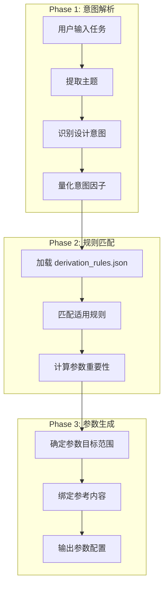

# Derivation Process - 参数推导过程

> **Version:** 2.0
> **Date:** 2026-01-13

---

## 概述

Asyre 的核心创新是**意图驱动的参数推导**：不是预设固定参数，而是根据创作意图动态推导。

```
传统方式: 形式(口播稿) → 固定参数组
Asyre方式: 意图因子组合 → 动态推导参数
```

---

## 推导流程



---

## Phase 1: 意图解析

### Step 1.1: 提取主题

从用户输入中识别：
- **话题领域**: 技术/社会/情感/商业/...
- **话题性质**: 争议性/知识性/情感性/...
- **目标受众**: 小白/进阶/专业/...

### Step 1.2: 识别设计意图

设计意图是一组**意图因子**的组合。每个因子代表一种创作目的。

**意图因子列表** (待通过 /learn 工作流完善):

| 因子 ID | 名称 | 描述 |
|:--------|:-----|:-----|
| `value_guidance` | 价值观引导 | 有目的性地引导观众的价值判断 |
| `persuasion` | 观点说服 | 让观众认同作者的观点/立场 |
| `concept_clarification` | 概念澄清 | 让人真正理解一个概念的本质 |
| `hidden_reveal` | 信息揭示 | 揭示表面之下的隐藏信息/真相 |
| `emotional_resonance` | 情感共鸣 | 唤起观众的情感认同 |
| `cognitive_disruption` | 认知颠覆 | 打破观众的固有认知 |
| `action_call` | 行动号召 | 推动观众采取具体行动 |
| `knowledge_transfer` | 知识传递 | 系统性地传授知识/技能 |
| `...` | (待补充) | 通过学习扩展 |

### Step 1.3: 量化意图因子

每个因子赋予 0.0-1.0 的权重：

```json
{
  "intent_factors": {
    "value_guidance": 0.8,
    "persuasion": 0.9,
    "concept_clarification": 0.3,
    "hidden_reveal": 0.6,
    "emotional_resonance": 0.7,
    "cognitive_disruption": 0.4,
    "action_call": 0.2,
    "knowledge_transfer": 0.3
  }
}
```

---

## Phase 2: 规则匹配

### Step 2.1: 加载推导规则

从 `Config/Schema/derivation_rules.json` 加载规则库。

### Step 2.2: 匹配适用规则

规则结构：

```json
{
  "rule_id": "R001",
  "name": "说服+价值引导 → 态度必须鲜明",
  "condition": {
    "operator": "AND",
    "factors": [
      { "factor": "persuasion", "op": ">=", "value": 0.7 },
      { "factor": "value_guidance", "op": ">=", "value": 0.6 }
    ]
  },
  "effect": {
    "parameters": [
      {
        "param": "attitude_strength",
        "importance": "critical",
        "target_range": [0.8, 1.0],
        "reference": {
          "glossary": ["Attitude_Output", "Fence_Sitting"],
          "formula": "Attitude_over_Analysis"
        }
      }
    ],
    "execution_rules": [
      "禁止'一方面...另一方面'句式",
      "必须在前30%内明确立场"
    ]
  }
}
```

### Step 2.3: 规则优先级

当多条规则影响同一参数时：

| 情况 | 处理方式 |
|:-----|:---------|
| 重要性冲突 | 取更高级别 (critical > high > medium > low) |
| 目标范围冲突 | 取交集；无交集时取更严格规则 |
| 参考内容冲突 | 合并所有参考 |

---

## Phase 3: 参数生成

### Step 3.1: 确定参数重要性

四级重要性系统：

| 级别 | 含义 | 处理方式 |
|:-----|:-----|:---------|
| `critical` | 必须满足 | 不满足则任务失败 |
| `high` | 强烈建议 | 偏离需要明确理由 |
| `medium` | 建议遵循 | 可根据情况调整 |
| `low` | 可选参考 | 可忽略 |

### Step 3.2: 绑定参考内容

每个参数绑定其参考来源：

```json
{
  "param": "attitude_strength",
  "importance": "critical",
  "target_range": [0.8, 1.0],
  "reference": {
    "level_0": {
      "glossary": ["Attitude_Output"],
      "formula": "Attitude_over_Analysis",
      "execution": ["禁止骑墙句式"]
    },
    "level_3": {
      "module": "Content_Creation",
      "file": "Oral_Script_Style.md",
      "section": "Phase 3: 态度鲜明",
      "external_citation": "Jonah Berger《Contagious》"
    }
  }
}
```

### Step 3.3: 输出最终配置

```json
{
  "task_context": {
    "topic": "为什么996是合法的？",
    "intent_factors": {
      "value_guidance": 0.9,
      "persuasion": 0.8,
      "emotional_resonance": 0.7
    }
  },
  "derived_parameters": {
    "attitude_strength": {
      "importance": "critical",
      "target": 0.9,
      "reference": "Formula:Attitude_over_Analysis"
    },
    "emotion_peaks": {
      "importance": "high",
      "target": 2,
      "reference": "Formula:Emotional_Wave_Formula"
    },
    "we_perspective": {
      "importance": "high",
      "target": 0.8,
      "reference": "Glossary:Eye_Level"
    },
    "rigor": {
      "importance": "medium",
      "target": 0.6,
      "reference": "Layer:T_Trustworthiness"
    }
  },
  "execution_rules": [
    "禁止'一方面...另一方面'句式",
    "必须使用'我们/咱们'视角",
    "设计至少2个情绪高潮点"
  ]
}
```

---

## 推导规则设计原则

### 规则来源

1. **从知识模块提炼**: Glossary 中的 `why_it_matters` 和 `common_mistakes`
2. **从公式提炼**: Formula 中的 `mechanism` 和 `anti_pattern`
3. **从实践反馈**: Feedback 中的成功/失败案例

### 规则验证

每条规则需要通过验证：

| 验证项 | 方法 |
|:-------|:-----|
| 条件合理性 | 意图因子组合是否常见 |
| 效果有效性 | 参数调整是否符合预期 |
| 无冲突 | 不与其他规则产生矛盾 |

---

## 扩展机制

### 添加新意图因子

1. 通过 `/learn` 工作流学习新的创作意图
2. 更新 `Config/Schema/intent_factors.json`
3. 添加相关的推导规则

### 添加新推导规则

1. 识别意图因子组合模式
2. 确定影响的参数和效果
3. 添加到 `Config/Schema/derivation_rules.json`
4. 验证无冲突

---

## 示例：完整推导过程

**输入：**
```
话题: "年轻人为什么不结婚了"
意图: 表达对婚姻制度的批判立场，引发讨论
```

**Step 1: 意图因子量化**
```json
{
  "value_guidance": 0.85,
  "persuasion": 0.8,
  "hidden_reveal": 0.7,
  "emotional_resonance": 0.75,
  "cognitive_disruption": 0.6
}
```

**Step 2: 匹配规则**
- R001: persuasion(0.8) >= 0.7 AND value_guidance(0.85) >= 0.6 ✓
- R003: emotional_resonance(0.75) >= 0.7 ✓
- R005: hidden_reveal(0.7) >= 0.6 ✓

**Step 3: 推导参数**
```json
{
  "attitude_strength": { "importance": "critical", "target": 0.9 },
  "emotion_peaks": { "importance": "high", "target": 2 },
  "we_perspective": { "importance": "high", "target": 0.8 },
  "hook_type": { "importance": "high", "value": "emotional_vent + hidden_reveal" },
  "climax_first": { "importance": "high", "target": 0.85 }
}
```

**Step 4: 执行规则**
```
- 开头使用情绪宣泄型钩子
- 必须在前20%内明确立场
- 禁止骑墙，禁止"因人而异"
- 设计2个情绪高潮点
- 使用"我们/咱们"视角
```
