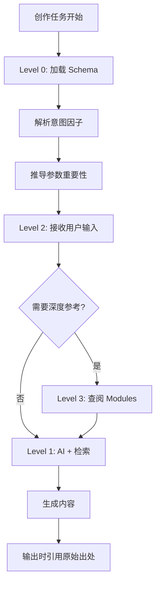

# Reference Hierarchy - 参考内容层次结构

> **Version:** 2.0
> **Date:** 2026-01-13

---

## 概述

Asyre 的参考内容分为四个层次，从低到高依次调用。

```
┌─────────────────────────────────────────────────────────────────┐
│                     Reference Hierarchy                          │
├─────────────────────────────────────────────────────────────────┤
│                                                                 │
│  Level 0: Schema 预设 (Pre-configured)                          │
│           ├─ 大颗粒度的默认规则和参数范围                         │
│           ├─ 意图因子 → 参数重要性的映射关系                      │
│           └─ 执行规则 (如"禁止骑墙句式")                         │
│                                                                 │
│  Level 1: AI 能力 + 网络检索 (Runtime)                          │
│           ├─ 模型本身的知识和判断能力                            │
│           ├─ 实时搜索的最新信息                                  │
│           └─ 上下文推理                                         │
│                                                                 │
│  Level 2: 用户输入 (User Input)                                 │
│           ├─ 具体话题、素材、个人经历                            │
│           ├─ 风格偏好、目标受众                                  │
│           └─ 特殊要求和约束                                      │
│                                                                 │
│  Level 3: Modules 深度知识库 (Deep Reference)                   │
│           ├─ 遇到核心问题时调用                                  │
│           ├─ 提供元认知、科学原理等底层答案                       │
│           └─ 输出时引用原始学术出处                              │
│                                                                 │
└─────────────────────────────────────────────────────────────────┘
```

---

## Level 0: Schema 预设

**触发条件：** 每次创作任务开始时自动加载

**内容来源：**
- `Config/Schema/_schema_master.json` — 参数定义
- `Config/Schema/intent_factors.json` — 意图因子
- `Config/Schema/derivation_rules.json` — 推导规则

**作用：**
- 提供参数的默认值和有效范围
- 定义意图因子到参数的映射规则
- 提供执行层面的硬性规则

**示例：**
```json
{
  "rule": "当 persuasion > 0.7 时，attitude_strength.importance = critical",
  "execution": "禁止使用'一方面...另一方面'句式"
}
```

---

## Level 1: AI 能力 + 网络检索

**触发条件：** 实时生成过程中

**内容来源：**
- 模型训练知识
- WebSearch 工具检索结果
- 上下文推理

**作用：**
- 填充 Schema 未覆盖的细节
- 获取最新信息和数据
- 根据具体情况做判断

**注意事项：**
- 网络检索结果需要事实核查
- AI 判断需要符合 Schema 规则约束

---

## Level 2: 用户输入

**触发条件：** 用户提供创作任务时

**内容来源：**
- 用户明确指定的话题
- 用户提供的素材和资料
- 用户的风格偏好

**优先级：**
- 用户输入 **覆盖** Level 0/1 的默认值
- 但不能违反 Schema 中的硬性规则

**示例：**
```
用户输入: "这篇要特别严谨，不要太情绪化"
效果: T层权重提升，D2_emotion_arousal 下调
```

---

## Level 3: Modules 深度知识库

**触发条件：** 遇到以下核心问题时

| 问题类型 | 调用模块 | 示例 |
|:---------|:---------|:-----|
| 写作方法论 | Content_Creation | "什么样的钩子最有效" |
| 心理学原理 | Psychology | "为什么人会有认知偏差" |
| 元认知问题 | Philosophy / Cognitive | "什么是知识的诅咒" |
| 逻辑推理 | Logic_and_Reasoning | "如何构建论证链" |

**引用规则：**

```
内部引用 (仅供推理):
  → 查阅 /Modules/Content_Creation/Hook_Techniques.md
  → 理解钩子的心理机制

外部输出 (面向读者):
  → 引用原始学术出处
  → "根据 Jonah Berger《Contagious》的研究..."
  → 不暴露内部文档路径
```

**当前可用模块：**
```
继承自: /Asher_Source_Profile_v1/02_Skill_Tree/Modules/
├── Content_Creation/
│   ├── 1.0_Hook_Techniques.md
│   ├── Oral_Script_Style.md
│   ├── Human_Like_Expression.md
│   ├── _Glossary_Index.json
│   └── _Formula_Index.json
└── (其他模块待建)
```

---

## 层次调用流程



---

## 冲突解决

当不同层次的信息冲突时：

| 冲突类型 | 解决方案 |
|:---------|:---------|
| 用户输入 vs Schema 默认值 | 用户输入优先 |
| 用户输入 vs Schema 硬性规则 | 硬性规则优先，提示用户 |
| AI判断 vs Modules 知识 | Modules 优先 (更权威) |
| 网络检索 vs Modules | 需要事实核查后判断 |
