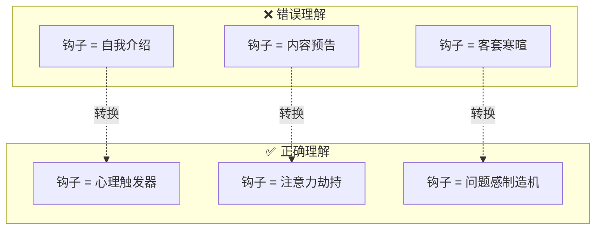
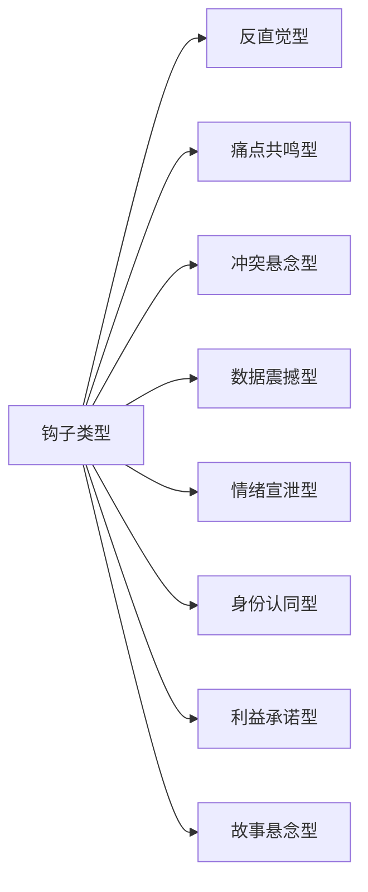
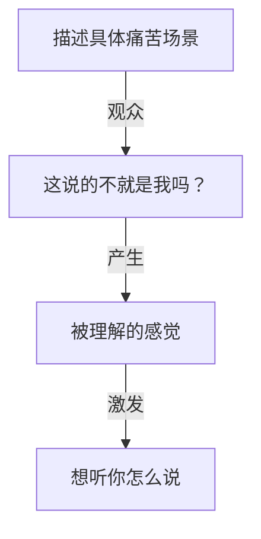
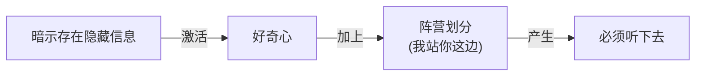
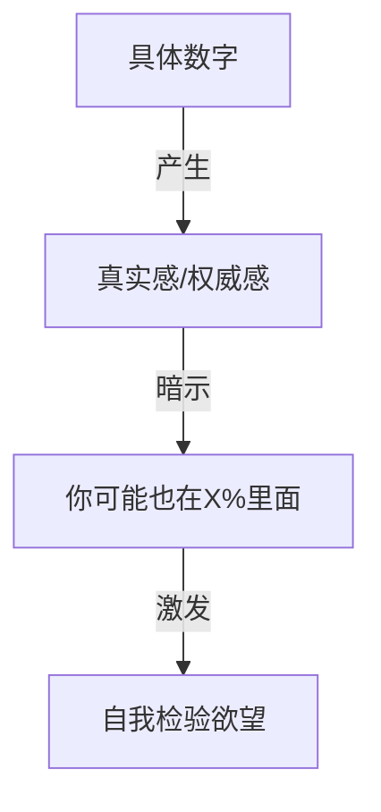
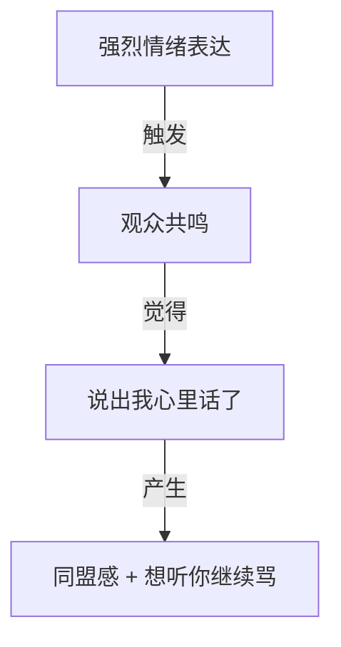
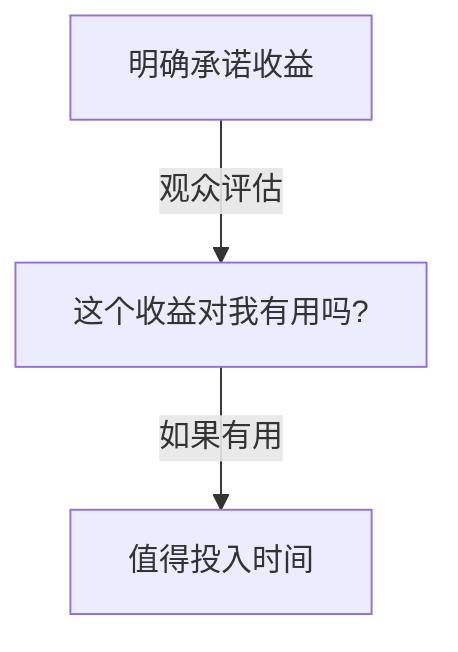
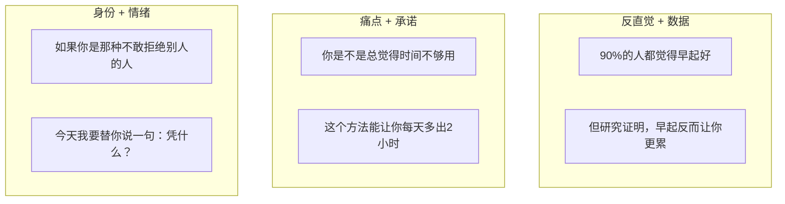

# Hook Techniques (钩子技巧)

> **Tags:** `[Content_Creation]`, `[Writing]`, `[Video]`, `[Attention]`
> **Date Added:** 2026-01-12
> **一句话总结 (One-Liner):** 钩子是内容的生死线——开头3秒决定观众是划走还是留下，核心不是"介绍内容"而是"制造问题感"。
> **关键协议 (Critical Protocol):**
> 1.  **3秒法则:** 最关键的信息必须在前3秒出现
> 2.  **问题感优先:** 制造"这跟我有关"的紧迫感
> 3.  **禁止自我介绍:** 开头只做一件事——抓住注意力

---

## 1. 元认知 (Metacognition)

*Why does this module exist?*

*   **问题定义:** 再好的内容，如果开头留不住人，就等于不存在。互联网时代注意力极度稀缺，观众的决策窗口只有3秒。绝大多数创作者死在开头。
*   **核心哲学:** **Hook is not introduction, it's interruption.** (钩子不是介绍，是打断)——你要打断观众滑动手指的惯性思维，让他停下来。
*   **系统定位:** 这是内容创作的**第一道门槛**。与 `Oral_Script_Style.md` 配合使用。

> [!IMPORTANT]
> **核心洞察 (Key Insight):** 观众不是来"学习"的，是来被**刺激**的。你的开头要激活他们的好奇心、焦虑感或情绪反应——而不是告诉他们"今天我们要聊什么"。

---

## 2. 核心架构 (Core Framework - The "What")

### 2.1 钩子的本质

钩子不是"开场白"。它是一个**心理触发器**。

**钩子的三层目标：**

| 层级 | 目标 | 时间窗口 |
|:----|:----|:--------|
| **第一层** | 阻止划走 | 0-1秒 |
| **第二层** | 激发好奇 | 1-3秒 |
| **第三层** | 建立关联 | 3-7秒 |

### 2.2 八大钩子类型

---

## 3. 执行协议 (Execution Protocol - The "How")

### Hook Type 1: 反直觉型 (Counter-Intuitive)

**机制:** 颠覆常识，激活认知冲突

**公式:** `"很多人以为 X，其实 Y"`

**触发原理:**

**案例矩阵:**

| 领域 | 错误常识 X | 反直觉真相 Y |
|:----|:----------|:-----------|
| 职场 | 努力就能升职 | 努力只是及格线，选择才是乘法 |
| 健身 | 多练多长肌肉 | 肌肉是休息时长的，不是练的 |
| 理财 | 省钱是致富之路 | 穷人思维的核心就是省钱 |
| 学习 | 刻苦就能学好 | 刻苦是最低效的学习方式 |
| 爱情 | 爱一个人要付出 | 付出越多越容易失去 |

**强效模板:**
- "年终奖发的越多，你反而越危险"
- "你越努力存钱，就越存不下钱"
- "90%的人都不知道，早起其实会让你更累"

---

### Hook Type 2: 痛点共鸣型 (Pain Point Resonance)

**机制:** 触碰观众正在经历的困扰，建立情感连接

**公式:** `"你是不是也有过这种感觉..."`

**触发原理:**

**痛点挖掘维度:**

| 维度 | 示例场景 | 钩子表达 |
|:----|:--------|:--------|
| **情绪痛点** | 焦虑、迷茫、无力 | "你有没有过那种，明明很累但就是睡不着的夜晚" |
| **行为痛点** | 拖延、控制不住、失败 | "每次下决心减肥，坚持不到三天就放弃" |
| **社交痛点** | 被忽视、被误解、孤独 | "在公司干了三年，感觉自己就是个透明人" |
| **成长痛点** | 停滞、迷失方向、怀疑自己 | "我都30了，还不知道自己到底擅长什么" |

**强效模板:**
- "周日晚上开始焦虑，一想到周一就心慌"
- "每次想开口表达，话到嘴边又咽回去了"
- "别人都在进步，只有我在原地踏步"

---

### Hook Type 3: 冲突悬念型 (Conflict Suspense)

**机制:** 制造信息不对称，暗示有"内幕"

**公式:** `"今天我要告诉你一件 X 不希望你知道的事"`

**触发原理:**

**冲突构建公式:**

| 元素 | 作用 | 示例 |
|:----|:----|:----|
| **隐藏者** | 制造对立方 | 老板/公司/机构/专家 |
| **秘密** | 制造信息落差 | 内幕/真相/潜规则 |
| **你** | 建立同盟 | 我来告诉你 |

**强效模板:**
- "这件事可能会得罪很多人，但我还是要说"
- "你老板绝对不希望你知道这个"
- "行业里都心照不宣的潜规则，今天我给你讲透"

---

### Hook Type 4: 数据震撼型 (Data Shock)

**机制:** 用具体数字制造冲击感，建立权威性

**公式:** `"X%的人在Y这件事上都搞错了"`

**触发原理:**

**数据使用规范:**

| 类型 | 效果强度 | 示例 |
|:----|:--------|:----|
| **极端占比** | ⭐⭐⭐⭐⭐ | "99%的人都不知道..." |
| **具体数量** | ⭐⭐⭐⭐ | "我研究了1000个案例..." |
| **时间跨度** | ⭐⭐⭐ | "花了3年时间总结出..." |
| **对比数据** | ⭐⭐⭐⭐⭐ | "同样的努力，结果差10倍" |

**强效模板:**
- "研究了500个失败案例，发现他们都犯了同一个错"
- "只有3%的人真正做对了这件事"
- "这个方法让我3个月涨粉50万"

---

### Hook Type 5: 情绪宣泄型 (Emotional Vent)

**机制:** 替观众说出他们想说但不敢说的话

**公式:** `"我真的受够了 X..."`

**触发原理:**

**情绪类型:**

| 情绪 | 场景 | 钩子表达 |
|:----|:----|:--------|
| **愤怒** | 不公平现象 | "凭什么我们要996，他们却能躺着赚钱" |
| **厌恶** | 虚伪行为 | "最烦那种嘴上说支持你，背后捅刀子的人" |
| **无奈** | 被迫接受 | "我真的不想这样，但我没得选" |
| **心疼** | 看到他人痛苦 | "每次看到这种新闻，我都觉得心里堵得慌" |

**强效模板:**
- "我真的很烦那种张口闭口'年轻人要吃苦'的人"
- "每次听到这种话我就火大"
- "受够了他们的双标"

---

### Hook Type 6: 身份认同型 (Identity)

**机制:** 让特定人群觉得"这是给我看的"

**公式:** `"如果你是 X 类型的人，一定要看这个"`

**触发原理:**

**身份标签库:**

| 维度 | 身份标签 |
|:----|:--------|
| **年龄** | 90后/30岁/刚毕业的人 |
| **职业** | 打工人/创业者/自由职业者 |
| **性格** | 内向的人/i人/敏感的人 |
| **状态** | 正在迷茫的人/刚分手的人/准备辞职的人 |
| **困境** | 月薪不到1万的人/还在租房的人 |

**强效模板:**
- "如果你是i人，这条你一定有共鸣"
- "给所有30岁还在迷茫的人"
- "这是专门给内向的人准备的"

---

### Hook Type 7: 利益承诺型 (Benefit Promise)

**机制:** 直接告诉观众看完能得到什么

**公式:** `"看完这个，你就知道如何 X"`

**触发原理:**

**收益设计规范:**

| 要素 | 要求 | 示例 |
|:----|:----|:----|
| **具体性** | 不能抽象 | ✅ "如何3分钟做完PPT" ❌ "如何高效工作" |
| **可量化** | 有数字更好 | ✅ "每天多出2小时" ❌ "更高效" |
| **紧迫性** | 暗示错过损失 | "不知道这个你会走很多弯路" |

**强效模板:**
- "学会这一招，你的沟通效率翻倍"
- "这三个技巧，能让你的视频播放量涨10倍"
- "看完这个视频，你就不会再被PUA了"

---

### Hook Type 8: 故事悬念型 (Story Suspense)

**机制:** 用故事开头，在关键处停住

**公式:** `"那天晚上发生了一件事，彻底改变了我..."`

**触发原理:**

**故事结构:**

| 阶段 | 内容 | 示例 |
|:----|:----|:----|
| **场景** | 时间地点人物 | "去年冬天，我刚被裁员的那个晚上" |
| **转折** | 意外发生 | "我在便利店遇到了一个陌生人" |
| **悬念** | 在高潮前停住 | "他说了一句话，我到现在还记得" |

**强效模板:**
- "三年前我做了一个决定，现在回头看..."
- "有个朋友跟我说了一番话，听完我沉默了很久"
- "那天发生的事，我从来没跟别人说过"

---

## 4. 钩子组合技 (Combo Techniques)

单一钩子有效，组合钩子更强。

**组合效力表:**

| 组合 | 效力 | 适用场景 |
|:----|:----|:--------|
| 反直觉 + 数据 | ⭐⭐⭐⭐⭐ | 科普/知识类 |
| 痛点 + 承诺 | ⭐⭐⭐⭐⭐ | 教程/方法类 |
| 身份 + 情绪 | ⭐⭐⭐⭐ | 情感/态度类 |
| 悬念 + 反直觉 | ⭐⭐⭐⭐ | 故事/案例类 |
| 冲突 + 情绪 | ⭐⭐⭐⭐⭐ | 观点/批评类 |

---

## 5. 钩子检验清单 (Quality Checklist)

写完钩子后，用这个清单自检：

| 检验项 | 问题 | 不通过的信号 |
|:------|:----|:-----------|
| **时间** | 核心信息是否在前3秒？ | 铺垫超过10个字 |
| **问题感** | 观众会觉得"这跟我有关"吗？ | 只是在陈述事实 |
| **情绪** | 有没有激发好奇/焦虑/共鸣？ | 听完没感觉 |
| **具体性** | 有没有具象画面或数字？ | 全是抽象词 |
| **禁区** | 有没有自我介绍/客套话？ | 出现"大家好" |

---

## 6. Anti-Patterns (反模式 - The "Don'ts")

### ❌ 反模式1: 自我介绍开头

**表现:** "大家好，我是XXX，今天我们来聊一聊..."

**Why:** 观众不关心你是谁，他们只关心"这跟我有什么关系"。

**Fix:** 直接切入钩子，自我介绍放到正文或结尾。

**❌ 错误案例:**
> "大家好，我是一名资深HR，从业十年，今天想跟大家分享一些面试技巧..."

**✅ 正确案例:**
> "上周我面了一个候选人，全程表现完美，但我还是没录用他。为什么？因为他犯了90%的求职者都在犯的一个错误。"

---

### ❌ 反模式2: 概念定义开头

**表现:** "XXX是指...它的特点是..."

**Why:** 定义是书面语言，没有情绪价值，观众会秒划走。

**Fix:** 用场景或问题引入概念，而不是先解释概念。

**❌ 错误案例:**
> "什么是复利？复利是指利息再生利息的过程..."

**✅ 正确案例:**
> "你知道为什么穷人越穷、富人越富吗？答案就藏在一个你可能听过一万遍但从没真正理解的词里——复利。"

---

### ❌ 反模式3: 背景铺垫过长

**表现:** 讲了30秒背景才进入正题

**Why:** 观众耐心只有3秒。铺垫过长=观众走光。

**Fix:** 背景放在钩子之后，用"倒叙"结构。

**❌ 错误案例:**
> "要理解这个问题，我们首先需要了解一些历史背景。在2008年金融危机之后..."

**✅ 正确案例:**
> "2008年有一个人做空了美国房市，一年赚了40亿美元。所有人都骂他疯子，但事后证明——他是唯一一个清醒的人。"

---

### ❌ 反模式4: 万能开头套话

**表现:** "相信很多人都..."、"众所周知..."、"说到XXX..."

**Why:** 毫无信息量，观众本能忽略。

**Fix:** 每个钩子都必须是定制的、具体的、有冲击力的。

**❌ 错误案例:**
> "相信很多朋友都对理财感兴趣..."

**✅ 正确案例:**
> "你存银行的钱，每年在以5%的速度消失。你可能觉得在存钱，其实在亏钱。"

---

### ❌ 反模式5: 过度承诺缺乏可信度

**表现:** "一招让你月入10万"、"三天学会英语"

**Why:** 夸张到不可信，观众会本能怀疑并划走。

**Fix:** 承诺要具体、可量化、符合常识。

**❌ 错误案例:**
> "学完这个，你下个月就能月入百万"

**✅ 正确案例:**
> "这个方法帮我把工作效率提升了3倍——每天同样的时间，能多做两件事"

---

## 7. Glossary (术语表)

| 术语 | Term | 定义 (人话) |
|:----|:----|:----------|
| 钩子 | Hook | 内容开头用来抓住注意力的那几秒 |
| 问题感 | Problem Sense | 让观众意识到"这跟我有关"的紧迫感 |
| 3秒法则 | 3-Second Rule | 观众决定划走还是留下只需要3秒 |
| 认知冲突 | Cognitive Conflict | 新信息和旧认知矛盾时产生的心理张力 |
| 痛点共鸣 | Pain Point Resonance | 触碰观众正在经历的困扰建立连接 |
| 信息落差 | Information Gap | 暗示你知道他不知道的事制造好奇 |
| 身份标签 | Identity Tag | 点名特定群体让他们觉得这是给他们看的 |
| 情绪宣泄 | Emotional Vent | 替观众说出他们想说但不敢说的话 |
| 利益承诺 | Benefit Promise | 明确告诉观众看完能得到什么 |
| 悬念断点 | Suspense Break | 故事在高潮前停住制造必须看下去的欲望 |
| 组合钩 | Combo Hook | 多种钩子类型叠加使用增强效果 |
| 禁区词 | Red Flag Words | 钩子中必须避免的词如"大家好"、"众所周知" |

---

## 8. Formula Table (公式表 - 3D Knowledge)

| Formula Name | Equation / Logic | Variable Definition |
|:-------------|:-----------------|:--------------------|
| **钩子效力公式** | `效力 = 问题感 × 情绪强度 × 具体性` | 三者缺一效果减半 |
| **3秒决策公式** | `留存率 = f(信息密度, 相关性, 冲击力)` | 前3秒必须三项全满 |
| **反直觉公式** | `冲击 = (常识 X) ↔ (真相 Y) 的距离` | 距离越大冲击越强 |
| **痛点公式** | `共鸣 = 场景具体度 × 普遍性` | 越具体越普遍越共鸣 |
| **承诺可信度** | `可信度 = 具体性 ÷ 夸张程度` | 太夸张可信度归零 |
| **组合效力** | `组合效力 = Hook1 + Hook2 + 协同加成` | 某些组合有额外加成 |

---

## 备注与引用 (Notes & References)

### 来源
- 内容创作实践经验
- 自媒体运营方法论
- 与 `Oral_Script_Style.md` 模块配合使用

### 核心原则速查

1. **3秒法则** — 生死线在开头
2. **问题感** — 不是介绍是打断
3. **8种类型** — 反直觉/痛点/冲突/数据/情绪/身份/承诺/故事
4. **组合技** — 单一有效组合更强
5. **禁区词** — 杀死"大家好"和"众所周知"
