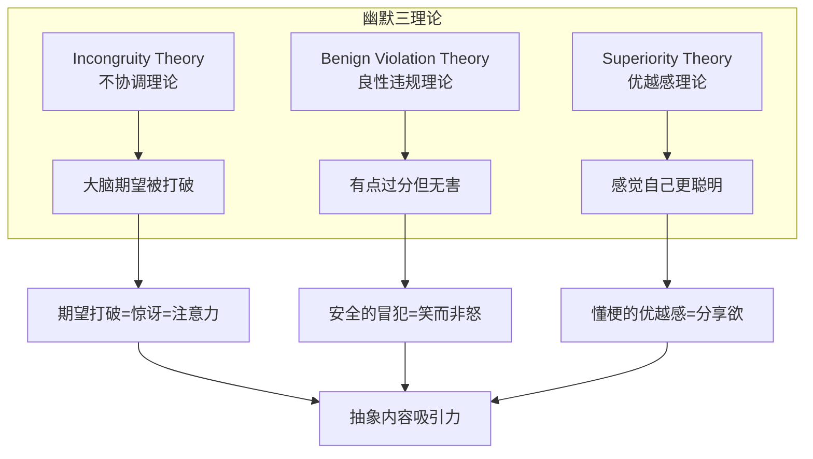
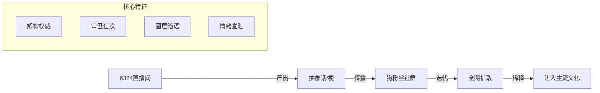
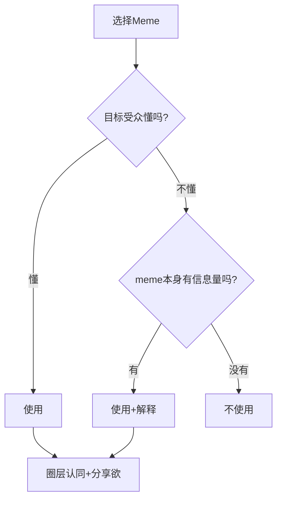

# Absurdist Content Style (抽象内容风格模块)

> **Tags:** `Psychology`, `Humor`, `Meme`, `Engagement`
> **Date Added:** `2026-01-13`
> **一句话总结:** 无厘头不是"不认真"，而是用荒诞的形式传递真实的洞察——打破期望本身就是抓住注意力的最强武器。
> **关键协议:**
> 1. **内容与形式分离:** 深刻的洞察 + 荒诞的表达 = 高级的无厘头
> 2. **Benign Violation:** 违反期望，但必须是"无害的"违反
> 3. **圈层密码:** Meme是社群的暗号，懂的人会因"我懂了"而狂喜

---

## 1. 元认知 (Metacognition)

### 问题定义
为什么同样有价值的内容，**用抽象/无厘头的方式讲，观众更爱看**？

传统内容创作者的困惑：
- "我讲的很有道理，但没人听"
- "他胡说八道，怎么这么多人点赞"
- "我准备了PPT，他只是发了个表情包"

**核心悖论:** 严肃的表达 ≠ 认真对待观众；荒诞的表达 ≠ 不尊重内容。

### 核心哲学

```
抽象内容的价值 = 洞察深度 × 表达反差 × 圈层共振

传统内容: 深刻的洞察 + 严肃的表达 = 正确但无聊
抽象内容: 深刻的洞察 + 荒诞的表达 = 有趣且深刻
```

> [!IMPORTANT]
> **核心洞察:** 人类大脑对"意外"有生理性的反应——当你打破期望时，大脑会释放多巴胺，这是奖励机制。**荒诞=意外=多巴胺=记忆深刻**。无厘头不是娱乐手段，是神经科学武器。

### 系统定位
本模块解决一个关键问题：**如何用"不正经"的方式讲"正经"的东西，并让观众更爱听**。

---

## 2. 核心架构 (Core Framework)

### 2.1 幽默心理学——三大理论

**为什么人会笑？三个理论的融合：**



### 2.2 Benign Violation Theory (良性违规理论)

**彼得·麦格劳 (Peter McGraw) 的核心发现：**

```
幽默发生的条件:
    违规 (Violation)  +  无害 (Benign)  =  笑 (Laughter)
         ↓                    ↓
    打破规范/期望      但不具有真正威胁
```

**"违规"的类型:**

| 违规类型 | 定义 | 抽象内容例子 |
|:---------|:-----|:-------------|
| **语言规范** | 说话方式不正常 | 把"我不同意"说成"你在放什么臭屁" |
| **逻辑规范** | 推理荒谬 | "因为你穷，所以你蠢" |
| **社会规范** | 行为出格 | 正式场合穿睡衣 |
| **审美规范** | 视觉冲突 | 精致的PPT配上鬼畜表情包 |
| **期望规范** | 结果意外 | 正经开头→离谱结尾 |

**如何让违规"无害"？**

| 方法 | 机制 | 例子 |
|:-----|:-----|:-----|
| **明确是玩笑** | 语境信号 | 夸张到不可能当真 |
| **自嘲先行** | 攻击目标是自己 | 先骂自己再骂别人 |
| **共同敌人** | 违规指向外部 | 嘲讽共同讨厌的对象 |
| **心理距离** | 抽离感 | meme格式=默认非严肃 |
| **社群共识** | 群体内部梗 | 只有懂的人才知道这是玩笑 |

### 2.3 Incongruity Theory (不协调理论)

**核心原理:** 当现实与期望不符时，大脑会产生一个"惊讶-解析"循环，这个过程本身会带来愉悦感。

```
期望 (Expectation)
    ↓
意外发生 (Incongruity)
    ↓
大脑解析 (Resolution)
    ↓
恍然大悟 (Aha! Moment)
    ↓
愉悦+记忆强化 (Dopamine Release)
```

**抽象内容的"不协调"设计:**

| 不协调类型 | 设计方法 | 例子 |
|:-----------|:---------|:-----|
| **反转式** | 正经开头+离谱结尾 | "关于投资，我有三点建议：1. 别投资 2. 别信我 3. 下期再见" |
| **混搭式** | 高雅+低俗 | 用古文体写外卖投诉 |
| **降维式** | 复杂→极简 | "量子力学就是：薛定谔养了只猫" |
| **升维式** | 日常→史诗 | 把做饭描述成"与饥饿的终极对决" |

### 2.4 中文互联网"抽象"文化

**抽象文化的本质:**



**抽象话的语言学分析:**

| 特征 | 功能 | 例子 |
|:-----|:-----|:-----|
| **emoji替代敏感词** | 规避审查 | 🐴=妈，🐂🍺=牛逼 |
| **首字母缩写** | 加密+效率 | nmsl, yyds |
| **谐音梗** | 双关+趣味 | 芭比Q了=完蛋了 |
| **方言混入** | 圈层标识 | 四川话元素 |
| **反讽/阴阳怪气** | 表达否定 | "你说的对" = 你放屁 |

**为什么抽象文化能传播？**

1. **规避审查:** 用暗语说不能直接说的话
2. **身份认同:** 懂梗=圈内人=归属感
3. **情绪出口:** 用荒诞消解焦虑
4. **对抗主流:** 用不正经反对正经
5. **多巴胺循环:** 看懂一个梗=智力奖励

---

## 3. 执行协议 (The "How")

### Phase 1: 洞察先行——内容深度不变

**核心原则:** 抽象的是表达方式，不是内容本身。

```
✅ 正确流程:
1. 先确定你要传达的核心洞察 (What's the point?)
2. 确保这个洞察本身是深刻的、有价值的
3. 再思考如何用"不正经"的方式包装它

❌ 错误流程:
1. 先想一个好笑的梗
2. 再想怎么凑内容
3. 结果只有形式没有深度
```

**洞察检验标准:**
- [ ] 如果去掉所有抽象元素，只留核心观点，这个观点本身有价值吗？
- [ ] 这个洞察是否有新意/反常识/深刻？
- [ ] 观众看完会不会"学到东西"？

### Phase 2: 反差设计——形式选择

**反差矩阵:**

| 内容类型 | 反差策略 | 例子 |
|:---------|:---------|:-----|
| **严肃话题** | 用轻松/调侃方式讲 | 讲经济危机用"你的钱又变少了"开头 |
| **技术教程** | 用生活化类比 | 把代码讲成"像给电脑写情书" |
| **鸡汤观点** | 反讽开局 | "今天讲三个道理，我自己都不信" |
| **热点评论** | 用抽象梗入场 | "我看完这个新闻，直接芭比Q了" |

**语言反差公式:**

```
传统表达: "这个观点我认为不正确"
抽象表达: "你搁这儿大声放什么臭屁呢"

传统表达: "经济形势很严峻"
抽象表达: "钱包：不是，哥们儿，我没了啊？"

传统表达: "这是一个复杂的问题"
抽象表达: "这个问题有多复杂？说出来你可能不信——我也不懂"
```

### Phase 3: Meme嵌入——圈层共振

**Meme使用原则:**



**Meme选择标准:**

| 标准 | 说明 | 例子 |
|:-----|:-----|:-----|
| **时效性** | 是否还是热梗 | "芭比Q"正热，"蓝瘦香菇"过时 |
| **普适性** | 受众能懂吗 | 6324梗太小众，"泰裤辣"更广泛 |
| **相关性** | 与内容有联系吗 | 不要硬塞不相关的梗 |
| **密度** | 不要太多 | 梗太多=抖机灵=没深度 |

### Phase 4: 节奏控制——正经与不正经的配比

**黄金配比 (参考):**

```
深度内容型: 70%正经 + 30%抽象
              └──>在正经内容中穿插几个关键笑点

纯娱乐型: 30%正经 + 70%抽象
           └──>核心观点明确，但表达全程无厘头

平衡型: 50%正经 + 50%抽象
         └──>正经-抽象-正经-抽象交替
```

**节奏模板:**

```
1. 抽象开头 (Hook) ← 吸引注意力
2. 正经过渡 (Bridge) ← 建立主题
3. 核心洞察 (Core) ← 传递价值
4. 抽象强化 (Punch) ← 用meme总结
5. 正经收尾 (CTA) ← 明确行动
```

---

## 4. Anti-Patterns (反模式)

### 陷阱 1: 只有形式没有深度

**Trap:** 全程抖机灵，观众笑完什么也没记住

**Why:** 误把"有趣"当成目标，忘了"有价值"才是核心

**Fix:** 
- 先写出不带任何抽象元素的"正经版"
- 确保这个版本本身有价值
- 再加入抽象元素

**Example:**
```
❌ 错误: "今天聊聊赚钱，我也不知道怎么赚，下期见，拜拜"
   → 只有形式，没有洞察

✅ 正确: "今天聊赚钱。首先你要明白一个残酷的真相：
          大部分人赚不到钱是因为他们在等机会。
          别等了，你等的那个机会不存在。
          好了，说完了，我继续去等我的机会了，拜拜"
   → 有洞察(不要等机会) + 有反差(自嘲)
```

**Positive Scenario:** 何同学的视频——看似轻松幽默，但每个视频都有明确的技术洞察或情感深度

---

### 陷阱 2: Meme堆砌成灾

**Trap:** 一分钟内塞10个梗，观众脑子过载

**Why:** 误以为梗越多越好，忽略了"认知负荷"

**Fix:**
- 每30秒最多1个meme/梗
- 每个梗都要有明确的功能（强调/类比/调侃）
- 删掉不增加信息量的梗

**Example:**
```
❌ 错误: "这件事儿吧，怎么说呢，直接芭比Q了家人们，
          yyds无敌，我真的栓Q了被美到了，寄了寄了"
   → 堆砌无意义

✅ 正确: "这个产品的定价策略，用一个词形容：芭比Q了。
          但为什么会这样？我们来看看..."
   → 一个梗作为钩子，然后正经分析
```

---

### 陷阱 3: 违规过度变冒犯

**Trap:** 梗太过分，从"好笑"变成"不适/愤怒"

**Why:** 忘记Benign Violation的"Benign"部分

**Fix:**
- 自嘲优先于嘲讽他人
- 攻击观点而非人身
- 明确的玩笑信号（表情、语气）
- 有争议的话题谨慎用梗

**Benign Violation边界:**

```
安全区域:
├─ 自嘲 → 永远安全
├─ 嘲讽抽象事物 → 安全
├─ 嘲讽负面行为 → 较安全
└─ 嘲讽公认反派 → 较安全

危险区域:
├─ 嘲讽特定人群 → 危险
├─ 涉及种族/性别/政治 → 非常危险
└─ 攻击观众本身 → 自杀行为
```

---

### 陷阱 4: 圈层壁垒太高

**Trap:** 用了一个只有0.1%人懂的梗，其他人一脸懵逼

**Why:** 高估了受众的meme literacy（梗素养）

**Fix:**
- 用大众化的meme，少用圈层梗
- 如果用小众梗，用法要自解释
- 或者，明确只针对特定圈层受众

**Example:**
```
❌ 错误: "这个产品的体验，懂得都懂，不懂的我也不解释，
          细说就是nmsl，6324还是那个6324"
   → 圈层太小，95%观众看不懂

✅ 正确: "这个产品的体验怎么说呢...
          想象一下你点了一份外卖，
          等了一小时送来发现是隔壁的。
          对，就是这种感觉。"
   → 普适的类比，人人能懂
```

---

## 5. 系统关联 (Interlinkages)

- **上游 (Input):**
  - `Oral_Script_Style.md` — 口播风格的基础技巧
  - `Hook_Techniques.md` — 钩子技术可与抽象风格结合

- **下游 (Output):**
  - 抽象风格可应用于任何创作场景
  - `Platform_Distribution_Strategy.md` — 不同平台对抽象内容的容忍度不同

---

## 6. Glossary (术语表)

| 术语 (EN) | 术语 (CN) | 定义 |
|:----------|:----------|:-----|
| **Benign Violation** | 良性违规 | 幽默发生的条件——违反规范但无害 |
| **Incongruity** | 不协调 | 期望与现实不符产生的惊讶效果 |
| **Meme Literacy** | 梗素养 | 理解和使用互联网梗的能力 |
| **Brainrot** | 脑腐内容 | 无意义但令人上瘾的互联网内容 |
| **Shitposting** | 水贴/抽象发言 | 故意发布无意义或荒诞内容 |
| **Post-Irony** | 后反讽 | 故意的低质量本身成为幽默 |
| **抽象话** | 抽象话 | 中文互联网的加密式圈层语言 |
| **In-group Signaling** | 圈层信号 | 用meme表明群体归属 |

---

## 7. Formula Table (公式表)

| 公式名 | 公式 | 变量定义 |
|:-------|:-----|:---------|
| **抽象内容价值公式** | `价值 = 洞察深度 × 表达反差 × 圈层共振` | 洞察=核心观点质量; 反差=表达出乎意料程度; 共振=meme命中率 |
| **Benign Violation公式** | `幽默 = Violation × Benign` | Violation=打破期望/规范; Benign=无害性 |
| **Incongruity效应公式** | `注意力 = 期望强度 × 反转幅度` | 期望越强+反转越大=注意力越高 |
| **Meme有效性公式** | `Meme效力 = 时效性 × 普适性 × 相关性` | 三者缺一不可 |
| **抽象密度公式** | `最佳密度 = 1梗/30秒` | 过多=堆砌; 过少=无趣 |

---

## 备注与引用 (Notes & References)

**研究来源:**
- Peter McGraw & Caleb Warren - Benign Violation Theory
- Incongruity-Resolution Model of Humor
- 中文互联网抽象文化分析 (wainao.me, thepaper.cn)
- Gen Z Brainrot Culture Studies

**最后更新:** 2026-01-13
