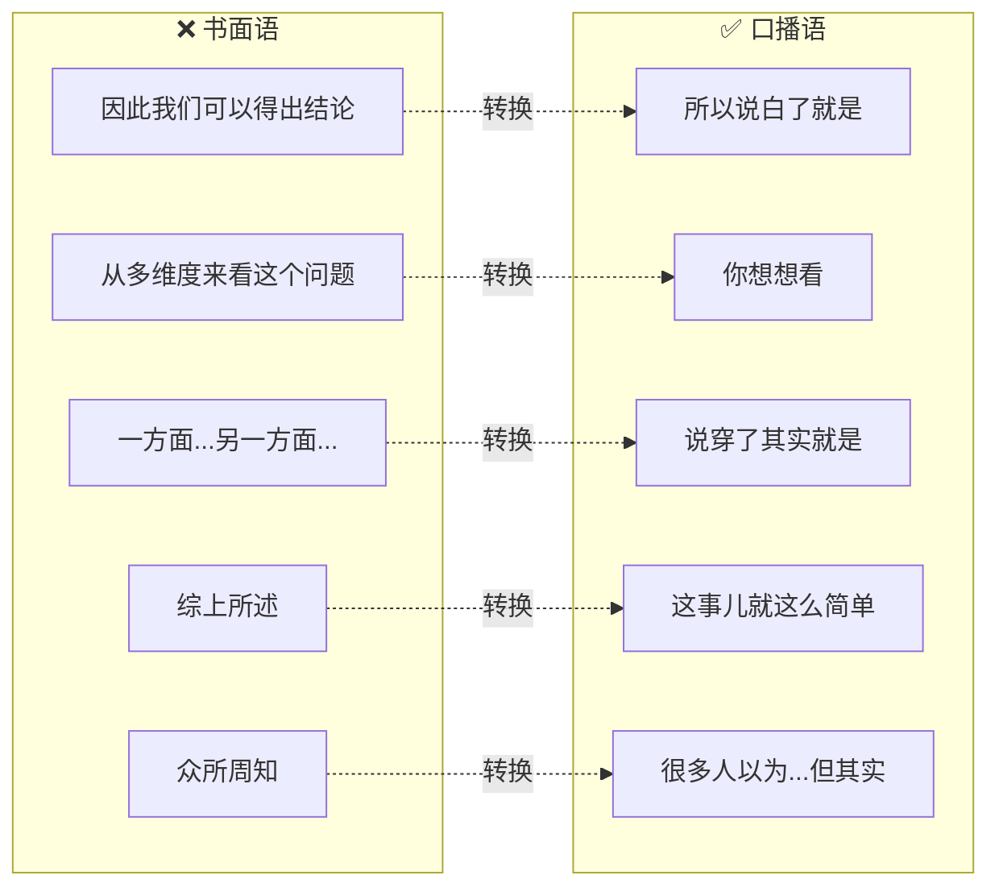
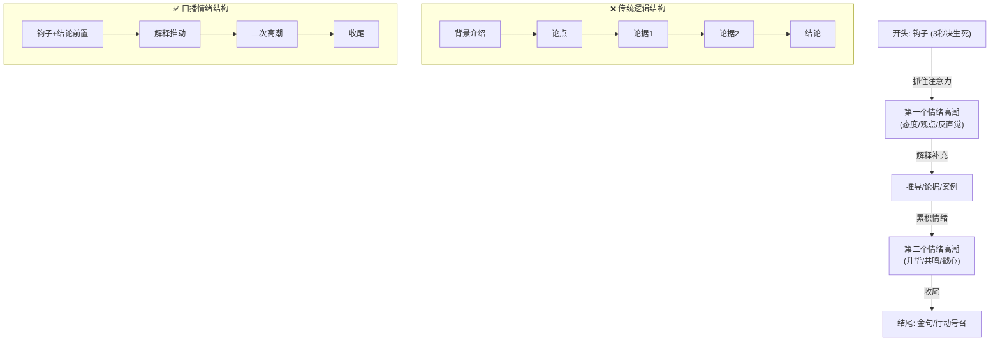
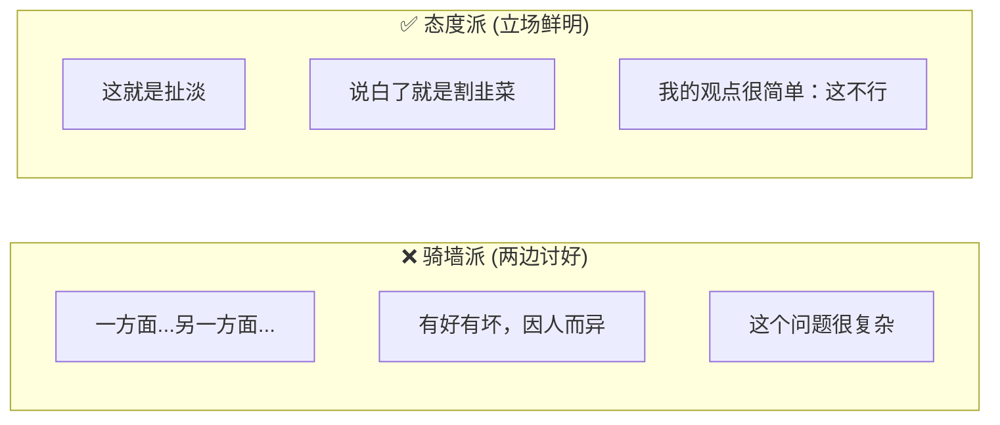
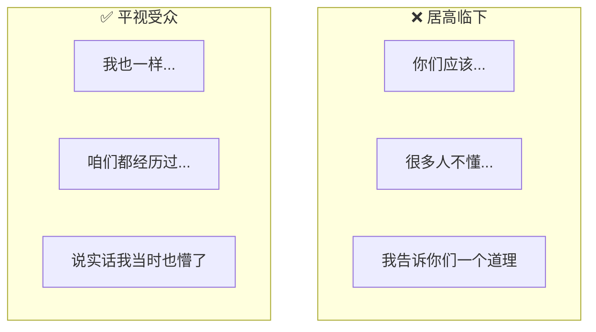

# 自媒体口播写作风格 (Oral Script Writing Style)

> **Tags:** `[Content_Creation]`, `[Writing_Style]`, `[Self_Media]`
> **Date Added:** 2026-01-12
> **一句话总结 (One-Liner):** 口播不是把书面文字读出来，而是用嘴巴说的节奏重新组织信息——开头抓人、情绪前置、态度鲜明、高潮前置解释后补。
> **关键协议 (Critical Protocol):**
> 1.  **结构服从情绪:** 逻辑完整不如情绪饱满。宁可牺牲推导过程，也要保证情绪节奏。
> 2.  **高潮前置:** 先给结论/情绪宣泄点，再补充解释。
> 3.  **禁止辩证:** 明确立场，不当骑墙派。

---

## 1. 元认知 (Metacognition)

*Why does this style guide exist?*

*   **问题定义:** AI 写出来的内容往往偏书面化、偏分析性、偏"两边都有道理"——这在口播场景下是致命的。观众的注意力只有3秒，他们需要的不是balanced analysis，是**情绪共鸣**和**态度输出**。
*   **核心哲学:** **Stand with the audience, not above them. (和观众站在一起，不要居高临下)**
*   **系统定位:** 这是AI写作风格的**口播化改造协议**，用于覆盖默认的书面化倾向。

> [!IMPORTANT]
> **核心洞察 (Key Insight):** 口播的本质不是"说话"，是**表演**。你不是在传递信息，你是在**唤起情绪**。

---

## 2. 核心架构 (Core Framework - The "What")

### 书面用语 vs 口播用语

口播不是把文字读出来。它有自己的语法。

**口播语言的核心特征:**

| 维度 | 书面语 | 口播语 |
|:----|:------|:------|
| **句子长度** | 长句嵌套，主谓宾复杂 | 短句为主，一句一个点 |
| **人称** | 第三人称/被动语态 | 第一人称"我"、第二人称"你" |
| **连接词** | "因此""故而""鉴于" | "所以""但是""你看" |
| **态度** | 客观中立 | 鲜明立场 |
| **节奏** | 平铺直叙 | 有张有弛，情绪波动 |

### 口播的情绪结构

口播不是按逻辑顺序组织内容，而是按**情绪节奏**组织内容。

---

## 3. 执行协议 (Execution Protocol - The "How")

### Phase 1: 开头钩子 (Hook) — 3秒定生死

**目标:** 让观众不划走。

**原则:** 开头不是介绍背景，是**制造问题感**。

**钩子矩阵:**

| 钩子类型 | 适用场景 | 示例 |
|:--------|:--------|:-----|
| **反直觉型** | 颠覆常识 | "年终奖发的越多，你反而越危险" |
| **痛点共鸣型** | 情感连接 | "你是不是也有过那种，明明很累但就是睡不着的夜晚" |
| **冲突悬念型** | 揭秘/黑幕 | "今天我要说一件可能会得罪很多人的事" |
| **数据震撼型** | 权威感 | "我研究了1000个案例，发现只有3%的人真正做对了这件事" |
| **情绪宣泄型** | 态度输出 | "我真的很烦那种，出了事就说'年轻人要吃苦'的人" |

**开头禁区:**

- ❌ "大家好，今天我们来聊一聊..."
- ❌ "众所周知..."
- ❌ 背景铺垫超过15秒
- ❌ 自我介绍（除非你是顶流）

### Phase 2: 高潮前置 — 先给结论再解释

**原则:** 观众没有耐心等你推导。先把最刺激的结论甩出来，再补充解释。

**转换公式:**

`书面: A → B → C → 结论D`

`口播: 结论D! → 因为C → 本质上是B → 追根溯源是A`

### Phase 3: 态度鲜明 — 禁止骑墙

**原则:** 口播不是学术论文，不需要"辩证地看问题"。观众要的是**态度**，不是analysis。

**态度表达技巧:**

| 场景 | 骑墙表达 | 态度表达 |
|:----|:--------|:--------|
| 批评现象 | "这个现象有其合理性，但也存在问题" | "这就是纯纯的PUA" |
| 给建议 | "这个方法可能适合部分人" | "别犹豫，直接做" |
| 分析原因 | "原因是多方面的" | "核心原因就一个" |
| 评价观点 | "每种观点都有道理" | "这个观点就是错的" |

### Phase 4: 情绪节奏 — 有张有弛

**原则:** 不能一直高能，也不能一直平淡。情绪要有波动。

**情绪节奏公式:**

`酝酿 → 爆发 → 缓冲 → 再酝酿 → 再爆发 → 收尾`

**节奏控制工具:**

| 工具 | 作用 | 示例 |
|:----|:----|:----|
| **短句爆发** | 情绪高潮 | "就这么简单。就这一条。记住了。" |
| **反问句** | 引发共鸣 | "你说气不气人？" |
| **停顿** | (口播时)制造悬念 | "答案是——" |
| **类比隐喻** | 形象化 | "这就像你养了个白眼狼" |
| **人称切换** | 拉近距离 | "你想想，如果是你..." |

### Phase 5: 和受众站在一起

**原则:** 不是"我来教你"，是"我们一起吐槽"。

**人称使用规则:**

| 人称 | 效果 | 适用场景 |
|:----|:----|:--------|
| **我** | 拉近距离，真实感 | 分享经历、表达态度 |
| **你** | 对话感，被针对感 | 提问、号召行动 |
| **咱们/我们** | 同盟感，共鸣 | 吐槽共同困境 |
| **他们/他** | 制造对立，划阵营 | 批评某类人/现象 |

---

## 4. Anti-Patterns (反模式 - The "Don'ts")

### ❌ 反模式1: 开头信息量过载

**表现:** 开头塞满"背景介绍"、"概念定义"、"重要性说明"，观众还没听完就划走了。

**Why:** 书面写作习惯——先交代背景再进入正题。

**Fix:** 开头只做一件事：**制造问题感**。背景后补，概念边用边解释。

**❌ 错误案例:**
> "大家好，今天我想和大家聊一聊关于职场焦虑的话题。职场焦虑是指在工作环境中产生的持续性压力和不安情绪，它在当代社会非常普遍，据统计有超过70%的白领都曾经历过..."

**✅ 正确案例:**
> "你有没有试过，周日晚上开始焦虑，一想到周一就心慌？这不是你脆弱——这是有人在系统性地消耗你。"

---

### ❌ 反模式2: 强行辩证两边讨好

**表现:** 分析完A的好处，马上补一句"但也有一些问题"；批评完B，又说"当然它也有可取之处"。

**Why:** 怕得罪人/怕不够"客观"。

**Fix:** 选定一个立场，把它讲透。辩证留给学术论文，口播要的是态度。

**❌ 错误案例:**
> "这个政策有它积极的一面，当然也存在一些值得商榷的地方。我们要辩证地看待这个问题，既看到机遇，也要意识到挑战。"

**✅ 正确案例:**
> "这政策就是在转嫁成本。别跟我扯什么'辩证看待'——受苦的是谁，获利的是谁，一目了然。"

---

### ❌ 反模式3: 逻辑链条过长才给结论

**表现:** 按照"因为A所以B因此C最终D"的顺序推导，到最后观众早忘了A是什么了。

**Why:** 追求论证完整性。

**Fix:** 先给D，再倒着解释为什么。观众的耐心只有10秒。

**❌ 错误案例:**
> "首先我们要理解经济周期的概念。经济周期分为复苏期、繁荣期、衰退期和萧条期。当我们处于衰退期的时候，消费会下降。消费下降导致企业利润减少。企业利润减少就会裁员。所以——现在是找工作最难的时候。"

**✅ 正确案例:**
> "现在是找工作最难的时候——不是你能力不行，是周期到了。经济下行，企业没利润，第一刀就砍人力成本。"

---

### ❌ 反模式4: 使用书面套话

**表现:** "众所周知"、"不言而喻"、"综上所述"、"换言之"...

**Why:** 默认写作模式是书面语。

**Fix:** 用口语替换。读出来不觉得奇怪才行。

**书面语 → 口播语 转换表:**

| 书面语 | 口播语 |
|:------|:------|
| 众所周知 | 很多人以为 / 你可能听说过 |
| 综上所述 | 说白了就是 |
| 换言之 | 意思就是 |
| 由此可见 | 你看 |
| 不言而喻 | 傻子都知道 |
| 值得注意的是 | 重点来了 |

---

### ❌ 反模式5: 情绪平铺没有高潮

**表现:** 从头到尾语气一样，像在读PPT。没有情绪爆发点。

**Why:** 把"客观"当成美德。

**Fix:** 至少设计2个情绪高潮点。用短句、反问、态度词制造爆发感。

**❌ 错误案例:**
> "这个现象确实存在。原因是多方面的。一方面是制度问题，另一方面是个人选择。我们需要理性看待。"

**✅ 正确案例:**
> "这事儿太离谱了。（爆发）为什么会这样？说穿了就两个字：贪婪。（第二次爆发）制度没问题，人心有问题。"

---

## 5. Glossary (术语表)

| 术语 | Term | 定义 (人话) |
|:----|:----|:----------|
| 钩子 | Hook | 开头3秒抓住观众的内容，决定他划不划走 |
| 高潮前置 | Climax First | 先给结论/情绪点，再补充解释 |
| 情绪节奏 | Emotional Rhythm | 内容的情绪起伏，像音乐有高潮有缓冲 |
| 骑墙 | Fence-sitting | 两边讨好，不敢表态，观众看了不爽 |
| 态度输出 | Attitude Output | 明确表达立场和情绪，敢说"这就是错的" |
| 口播语 | Oral Language | 适合说出来的语言，区别于书面语 |
| 人称切换 | Pronoun Shift | 在"我/你/我们/他们"之间切换制造不同效果 |
| 平视受众 | Eye-Level | 和观众站在同一位置，而不是居高临下教育 |

---

## 6. Formula Table (公式表 - 3D Knowledge)

| Formula Name | Equation / Logic | Variable Definition |
|:-------------|:-----------------|:--------------------|
| **Hook Formula** | `Hook = 反直觉 + 痛点共鸣 + 问题感` | 三者至少占一个 |
| **Climax First** | `口播顺序 = D → C → B → A` | 结论前置，解释后补 |
| **Attitude > Analysis** | `吸引力 = 态度鲜明度 × 情绪强度` | 辩证分析 = 0态度 = 低吸引力 |
| **Emotional Wave** | `节奏 = 酝酿 → 爆发 → 缓冲 → 再爆发` | 像心电图，不能一条直线 |
| **We > I > You > They** | `亲近感 = 人称选择 × 立场一致性` | "咱们"拉近距离，"他们"制造对立 |

---

## 7. 系统关联 (Interlinkages)

*   **上游:** `1.0_Hook_Techniques.md` → 钩子技巧参考
*   **上游:** `Style_Library.json` → 博主风格样本
*   **下游:** `/create-script` 工作流 → 作为写作风格指令

---

## 备注与引用 (Notes & References)

### 来源
- 用户输入的口播写作要求

### 核心原则速查

1. **开头3秒抓人** → 钩子制造问题感
2. **高潮前置** → 先给结论再解释
3. **态度鲜明** → 禁止骑墙辩证
4. **情绪节奏** → 有爆发有缓冲
5. **平视受众** → 和观众站一起不居高临下
6. **口播语言** → 短句、人称、说人话
