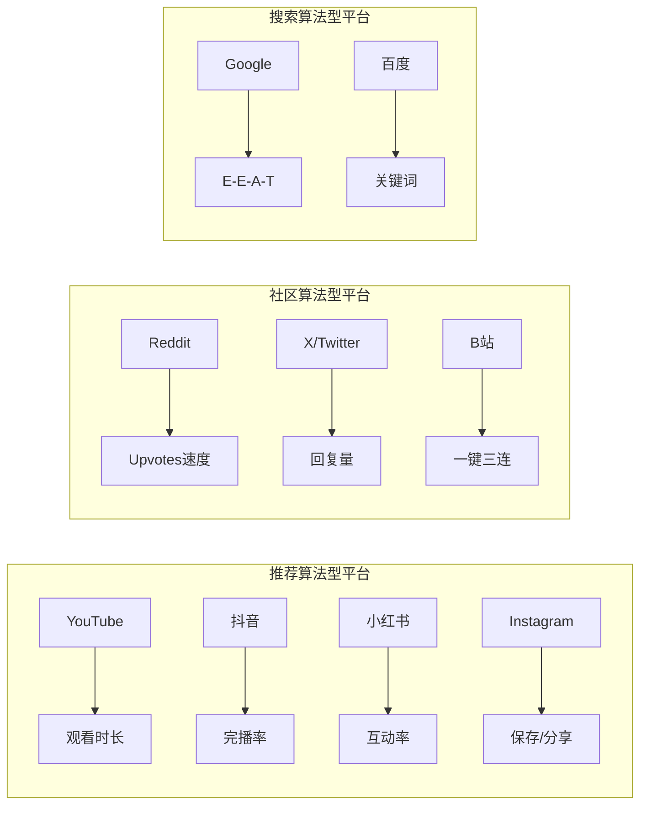
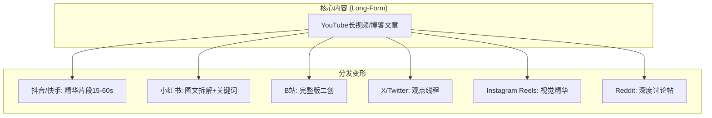
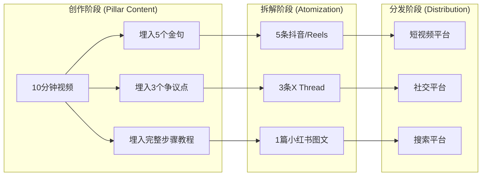

# Platform Distribution Strategy (平台分发策略模块)

> **Tags:** `SEO`, `Algorithm`, `Distribution`, `Growth`
> **Date Added:** `2026-01-13`
> **一句话总结:** 同一内容在不同平台需要"变形"——每个平台都是一个独立的生态系统，有自己的算法规则、用户期望和成功公式。
> **关键协议:**
> 1. **平台原生化 (Platform Native):** 内容必须适配平台调性，而非跨平台复制粘贴。
> 2. **核心指标驱动 (Metric-Driven):** 理解每个平台的核心排名因子，针对性优化。
> 3. **算法理解 (Algorithm Literacy):** 算法不是黑箱，是可以逆向工程并利用的规则。

---

## 1. 元认知 (Metacognition)

### 问题定义
再好的内容，如果不懂分发，就像在真空中呐喊——没人能听见。

**分发的本质:** 让正确的内容，在正确的平台，以正确的形式，出现在正确的人面前。

### 核心哲学
```
内容价值 = 创作质量 × 分发效率
         = What You Say × Where & How You Say It
```

**跨平台分发的悖论:**
- 错误思维: "内容好就会火" → 被动等待算法青睐
- 正确思维: "内容好 + 懂规则 = 火" → 主动与算法博弈

### 系统定位
本模块是 Asyre 内容体系的**放大器**——负责将创作的价值最大化传递。

> [!IMPORTANT]
> **核心洞察:** 每个平台都是一个独立的"考试系统"，有自己的评分标准。你拿着同一份答案去不同的考场，未必能及格——你需要针对每个考场"重新答题"。

---

## 2. 核心架构 (Platform Taxonomy)

### 2.1 平台分类矩阵

| 维度 | 视频平台 | 图文平台 | 社交平台 | 搜索引擎 |
|:-----|:---------|:---------|:---------|:---------|
| **国际** | YouTube | Medium | X/Twitter, Reddit, Instagram | Google |
| **中国** | 抖音, 快手, B站 | 小红书 | 微信, 微博 | 百度 |
| **核心货币** | 观看时长 | 阅读深度 | 互动/转发 | 点击率+停留 |

### 2.2 算法本质对比



---

## 3. 分平台深度解析

---

### 🔴 YouTube - 全球最大长视频平台

#### 3.1.1 算法核心机制

**推荐系统工作流程:**
```
1. 候选召回 (1500条) → 2. 机器学习排序 → 3. 过滤去重 → 4. 混合呈现
```

**算法的底层逻辑——"满意度预测机":**

YouTube算法的本质不是"推荐好内容"，而是**预测用户满意度**。它不关心视频本身好不好，只关心：
- 这个用户看了会不会满意？
- 会不会继续在平台停留？
- 会不会明天还来？

> [!IMPORTANT]
> **核心洞察:** YouTube算法是一个"利己"系统——它的KPI是用户时长，不是创作者成功。你的成功只是它KPI的副产品。

**核心排名因子 (权重从高到低):**

| 因子 | 定义 | 心理机制 | 优化策略 |
|:-----|:-----|:---------|:---------|
| **观看时长 (Watch Time)** | 用户观看视频的总时长 | 时长=投入=价值证明 | 内容要"拉住人"，长视频优势 |
| **点击率 (CTR)** | 缩略图被点击的概率 | 好奇心+期望值 | 缩略图+标题制造"信息缺口" |
| **观众留存率 (Retention)** | 观看完成的百分比 | 持续满足期望 | 每30秒一个"小高潮" |
| **互动 (Engagement)** | 点赞/评论/分享 | 情绪唤醒后的行动欲 | 引导互动但不乞讨 |
| **频道权威度** | 历史表现+订阅者 | 信任积累 | 持续发布，建立信誉 |

**留存率曲线解读——诊断工具:**

```
理想曲线:    ████████████████████  (平稳，>70%)
钩子失败:    ██████░░░░░░░░░░░░░░  (开头断崖)
中间塌陷:    ████████░░░░████████  (中段拖沓)
结尾流失:    ██████████████░░░░░░  (没有收尾钩子)
```

**实战案例——MrBeast 的"Promise-Deliver"循环:**
```
0:00 → 标题承诺 ("I Gave $1M to Random Strangers")
0:30 → 快速兑现第一个承诺 (建立信任)
2:00 → 升级承诺 ("But wait, it gets crazier...")
5:00 → 再次兑现 + 新承诺...
(循环至结尾)
```
**为什么有效:** 持续制造期望-兑现循环，观众无法找到"安全离开点"。

**2024-2025 算法更新:**
- **新频道快速测试:** 小频道若早期数据强，48小时内会被快速推流测试
- **系列内容加权:** 剧集/系列格式观看时长+30%，因为用户会连续看
- **多语言内容:** 开启多语言配音/字幕，可获得跨语言推荐
- **Shorts与长视频协同:** Shorts表现好会带动长视频曝光

#### 3.1.2 YouTube SEO 深度公式

```
YouTube排名 = f(关键词匹配, 视频表现, 频道权威)
           = 被发现的概率 × 被点击的概率 × 被看完的概率
```

**缩略图心理学——3秒决胜:**

| 元素 | 心理机制 | 最佳实践 |
|:-----|:---------|:---------|
| **大脸+夸张表情** | 人脸优先处理机制 | 占画面40%+，情绪明确 |
| **高对比色** | 在信息流中跳出 | 黄/红/青 vs 灰色背景 |
| **少量文字** | 降低认知负荷 | 最多3个大字，无衬线字体 |
| **悬念元素** | 制造信息缺口 | 模糊关键物体、箭头指向 |
| **与标题互补** | 双重信息传递 | 缩略图是"画"，标题是"话" |

**标题公式 (结构化):**

```
[数字/时间] + [核心价值] + [情绪词/悬念]

例:
✅ "7天学会剪辑，从零到接单"          (数字+价值+结果)
✅ "我花了$50,000学到的教训"          (数字+悬念+损失厌恶)
❌ "剪辑教程分享"                     (无差异化，无情绪)
```

#### 3.1.3 数据基准与诊断矩阵

| 指标 | 警戒线 | 健康范围 | 优秀标准 | 诊断 |
|:-----|:-------|:---------|:---------|:-----|
| CTR | <2% | 2-10% | >10% | 低CTR=封面/标题问题 |
| 平均观看时长 | <30% | 30-50% | >50% | 低留存=内容/节奏问题 |
| 互动率 | <1% | 1-5% | >5% | 低互动=情绪唤醒不足 |
| 订阅转化 | <0.5% | 0.5-2% | >2% | 低转化=价值定位模糊 |

**诊断决策树:**
```
曝光低？
├─ CTR低 → 优化缩略图/标题
└─ CTR正常 → SEO问题，优化关键词

曝光高但观看时长低？
├─ 开头流失严重 → 钩子问题
├─ 中间流失 → 节奏/密度问题
└─ 结尾流失正常 → 可接受

观看时长高但增长慢？
└─ 互动少/分享少 → 增加情绪高潮点和分享动机
```

---

### 🔵 抖音 (Douyin) - 中国短视频霸主

#### 3.2.1 算法核心机制

**流量池模型——理解"赛马机制":**
```
冷启动池 (300-500曝光) 
    ↓ 完播率>40% + 互动率>3%
2级池 (1000-5000)
    ↓ 持续达标
3级池 (5万-50万)
    ↓ 持续优秀+账号权重
热门池 (百万级)
    ↓ 被算法"选中"
超级爆款 (千万级)
```

> [!IMPORTANT]
> **核心洞察:** 抖音不是"内容越好越火"，而是"数据越好越火"。一个平庸但完播率高的视频，会击败优秀但完播率低的视频。**算法不懂内容质量，只懂数据信号。**

**"赛马"心理学:**
- 每个流量池都是一场"淘汰赛"
- 你不是在和全平台竞争，而是在和同池视频竞争
- 相对表现决定晋级，绝对质量无意义

**完播率的暴力优化——时长策略:**

| 账号阶段 | 推荐时长 | 原因 |
|:---------|:---------|:-----|
| 新账号冷启动 | 7-15秒 | 确保高完播率建立账号权重 |
| 稳定期 | 15-30秒 | 平衡完播率和信息量 |
| 成熟账号 | 30-60秒 | 账号权重高可承担更长时长 |
| IP账号 | 1-3分钟 | 粉丝愿意看长内容 |

**实战案例——"钩子模板":**
```
❌ 错误开头: "大家好，今天我们来聊聊..."  (2秒流失40%)
✅ 正确开头:
   - 结论前置: "月薪3万和月薪3千的区别，就在这一点"
   - 反常识: "我劝你别学英语了"
   - 数字冲击: "这个错误让我损失了50万"
   - 情绪引爆: "看完这个视频我气得睡不着觉"
```

**2024 算法四大更新:**
1. **播放时长权重提升:** 不只是完播率，用户"多次观看同一视频"权重极高
2. **搜索-推荐联动:** 用户搜索过的关键词会影响推荐流，布局搜索词可获双重流量
3. **内容-交易流量打通:** 带货视频不再被限制在交易池
4. **深度互动加权:** 评论回复、点击主页、看其他视频 > 单纯点赞

#### 3.2.2 互动率提升——"槽点设计"

**为什么需要"槽点":**
- 评论权重 > 点赞权重
- 争议性 = 讨论度 = 算法信号
- 用户在评论区的情绪释放会增加停留时长

**设计槽点的4种方法:**

| 方法 | 例子 | 风险 |
|:-----|:-----|:-----|
| **故意犯小错** | 把"LV"说成"LU" | 评论区纠正=互动 |
| **留悬念不解答** | "原因我下期说" | 可能被骂但互动高 |
| **抛出争议观点** | "我觉得xxx不对" | 两派互怼=流量 |
| **末尾提问** | "你遇到过这种情况吗？" | 最安全的互动引导 |

#### 3.2.3 DOU+科学投放

**投放时机矩阵:**

| 视频表现 | 是否投放 | 原因 |
|:---------|:---------|:-----|
| 冷启动数据差 | ❌ 不投 | 花钱也救不回来 |
| 冷启动数据中等 | ⚠️ 小额测试 | 可能被推起来 |
| 冷启动数据好但卡住 | ✅ 重点投放 | 用钱撬动自然流量 |
| 自然流量已经很高 | ❌ 不投 | 浪费钱，自然会涨 |

**投放目标选择:**
- **粉丝增长:** 精准，但贵
- **点赞评论:** 适合造势，数据好看
- **主页访问:** 适合IP账号，建立认知

#### 3.2.4 反模式与诊断

| 症状 | 诊断 | 修复 |
|:-----|:-----|:-----|
| 完播率<25% | 开头无钩子 / 视频过长 | 重做开头 / 压缩时长 |
| 完播率高但互动低 | 内容"正确但无聊" | 增加情绪点/争议点 |
| 互动高但不涨粉 | 价值定位模糊 | 增加个人IP标签 |
| 数据都好但限流 | 触发敏感词/举报 | 检查违规词，申诉 |

---

### 🟢 小红书 (Xiaohongshu/RED) - 种草决策平台

#### 3.3.1 算法核心机制

**双塔模型——小红书的"匹配引擎":**
```
用户兴趣塔              ×              内容质量塔
(历史行为/偏好/画像)                  (原创度/专业度/互动)
        ↓                                    ↓
    用户向量                              内容向量
        └───────── 相似度计算 ─────────┘
                      ↓
              实时反馈加权 (前30分钟=60%权重)
                      ↓
                个性化推荐分发
```

> [!IMPORTANT]
> **核心洞察:** 小红书是"人找内容"的搜索平台，不只是"内容找人"的推荐平台。**70%月活用户有搜索行为，9成用户消费决策受搜索影响。** SEO在小红书的重要性远超抖音。

**搜索vs推荐——两种流量的获取逻辑:**

| 维度 | 推荐流量 | 搜索流量 |
|:-----|:---------|:---------|
| 用户意图 | 漫无目的刷 | 有明确需求 |
| 竞争对手 | 同时段同品类笔记 | 关键词下所有历史笔记 |
| 生命周期 | 48小时衰减 | 可持续数月 |
| 优化重点 | 封面+前3秒 | 标题关键词+内容深度 |

**核心排名因子 (深度拆解):**

| 因子 | 权重 | 心理机制 | 优化策略 |
|:-----|:-----|:---------|:---------|
| **前30分钟数据** | 60% | 冷启动验证 | 发布后立即互动养号 |
| **完播率** | ⭐⭐⭐⭐⭐ | 内容价值验证 | 信息密度要高，避免水字 |
| **收藏率** | ⭐⭐⭐⭐⭐ | 实用价值证明 | 提供可操作清单/教程 |
| **评论率** | ⭐⭐⭐⭐ | 情绪共鸣/争议度 | 抛问题，引发讨论 |
| **关键词匹配** | ⭐⭐⭐⭐ | 搜索意图匹配 | 标题必含核心词 |
| **账号权重** | ⭐⭐⭐ | 信任积累 | 垂直+原创+活跃 |

**2024 社区三大变化:**
1. **知识类权重+30%:** 干货内容更易获推荐，"有用"比"好看"更重要
2. **账号信誉分系统:** 低于8分限流，违规记录影响长期权重
3. **原创度算法升级:** <60%原创可能降权，搬运内容基本无流量

#### 3.3.2 小红书 SEO 深度公式

```
小红书搜索排名 = 关键词匹配度 × 笔记质量分 × 账号权重 × 互动表现
             = 被搜到 × 值得看 × 作者可信 × 用户认可
```

**关键词策略——从选词到布局:**

**Step 1: 挖掘关键词**
```
站内渠道:
├─ 搜索下拉框 (高频搜索词)
├─ "大家还在搜" (相关词扩展)
├─ 热门笔记标题 (竞品分析)
└─ 评论区高频词 (用户痛点)

站外渠道:
├─ 5118.com (搜索量+竞争度)
├─ 电商平台联想词 (购买意图词)
└─ 百度指数 (趋势判断)
```

**Step 2: 关键词分层**
| 类型 | 特点 | 例子 | 使用位置 |
|:-----|:-----|:-----|:---------|
| **核心词** | 高搜索量，高竞争 | "护肤" | 标题必含 |
| **长尾词** | 中搜索量，低竞争 | "油皮护肤推荐" | 正文嵌入 |
| **场景词** | 低搜索量，精准 | "换季敏感肌护肤" | 话题标签 |

**Step 3: 关键词布局模板**
```
标题: [核心词] + [场景/人群] + [价值点]
例: "油皮护肤｜平价好用的水乳推荐（学生党必看）"

正文结构:
├─ 开头: 痛点共鸣 + 核心词
├─ 中间: 干货内容 + 长尾词自然嵌入
└─ 结尾: 总结 + 互动引导

话题: #核心词 #场景词 #品牌词 (3-5个)
```

#### 3.3.3 笔记结构——"爆款模板"

**图文笔记结构 (适合教程/清单类):**
```
封面图: 信息量高 + 核心词 + 视觉吸引
├─ 第1张: 结果展示/痛点击中
├─ 第2-N张: 步骤详解/产品对比
└─ 最后1张: 总结清单/收藏提示

正文: 
├─ 开头: 共鸣句 ("姐妹们，xxx问题是不是困扰你很久了？")
├─ 主体: 清单/步骤/对比 (易读，可执行)
└─ 结尾: 互动引导 ("你们还想看什么类型的推荐？")
```

**视频笔记结构 (适合vlog/评测类):**
```
0-3秒: 钩子 (结果前置/痛点/悬念)
3-15秒: 价值承诺 ("今天分享3个xxx技巧")
15秒-结尾: 干货内容 (节奏紧凑，每30秒一个新信息点)
结尾: 总结 + 互动引导
```

#### 3.3.4 账号权重提升——"养号"科学

**新账号启动流程 (前7天):**
```
Day 1-3: 观察期
├─ 每天浏览30分钟
├─ 搜索目标领域关键词
├─ 点赞/收藏/评论同领域笔记 (模拟真实用户)
└─ 不发布任何内容

Day 4-5: 试水期
├─ 发布1-2篇简单笔记
├─ 观察数据反馈
└─ 回复所有评论

Day 6-7: 爆发期
└─ 发布准备好的优质内容
```

**账号权重诊断表:**
| 维度 | 及格线 | 优秀标准 | 方法 |
|:-----|:-------|:---------|:-----|
| **内容垂直度** | 80%同领域 | 95%+ | 不跨领域 |
| **原创度** | >60% | >90% | 避免搬运 |
| **互动率** | >3% | >8% | 回复每条评论 |
| **信誉分** | >8分 | 满分 | 不违规 |

---

### 🔵 B站 (Bilibili) - 二次元/知识中长视频

#### 3.4.1 算法核心机制

**推荐特点:**
- **时效性偏好:** 倾向推荐近期发布的视频
- **一键三连权重:** 点赞+投币+收藏的复合行为
- **播放量仍为核心指标:** 曾计划改为播放时长，但2024年取消

**核心排名因子:**

| 因子 | 定义 | 优化方向 |
|:-----|:-----|:---------|
| **一键三连率** | 三连/播放量 | 内容要值得"币" |
| **弹幕密度** | 弹幕数/视频时长 | 制造弹幕梗 |
| **完播率** | 看完的比例 | 节奏紧凑 |
| **发布时间** | 新鲜度 | 避免长期断更 |

#### 3.4.2 B站优化策略

| 策略 | 执行 |
|:-----|:-----|
| **做系列** | 分P/合集增加用户停留 |
| **引导三连** | 结尾明确请求 |
| **弹幕设计** | 留槽点让观众吐槽 |
| **动态互动** | 发布动态与粉丝互动 |

---

### 🟡 快手 (Kuaishou) - 下沉市场短视频

#### 3.5.1 算法核心机制

**公私域联动:**
```
公域冷启动 → 数据反馈 → 流量池升级 → 私域沉淀
     ↑_____________________________|
              粉丝互动反哺公域
```

**核心特点:**
- **普惠原则:** 中小创作者友好，头部流量被限制
- **私域权重高:** 粉丝互动影响公域曝光
- **作品全生命周期助推:** 不仅看首发数据

**核心排名因子:**

| 因子 | 说明 |
|:-----|:-----|
| **点赞率** | 高于均值获加权 |
| **次均播放时长** | 用户平均观看时长 |
| **收藏率** | 表明内容价值 |
| **涨粉比** | 视频带来的粉丝增量 |

---

### 🔵 X/Twitter - 全球实时社交平台

#### 3.6.1 算法核心机制

**For You 推荐流程:**
```
候选召回 (1500条) → RealGraph评分 → 过滤去重 → 混合广告
```

**核心排名因子:**

| 因子 | 权重 | 优化方向 |
|:-----|:-----|:---------|
| **回复量** | ⭐⭐⭐⭐⭐ | 引发对话最重要 |
| **互动历史** | ⭐⭐⭐⭐ | 与目标用户多互动 |
| **媒体内容** | ⭐⭐⭐ | 图片/视频优于纯文字 |
| **视频观看>10秒** | ⭐⭐⭐ | 短视频要足够吸引 |
| **实时性** | ⭐⭐⭐ | 蹭热点有加成 |

**负面因子:**
- 全大写
- 过多链接
- 重复发布
- 被 mute/block

#### 3.6.2 X 优化策略

| 策略 | 做法 |
|:-----|:-----|
| **对话优先** | 写能引发回复的内容 |
| **投票/问题** | 提升互动 |
| **线程 (Thread)** | 长内容拆分成多条 |
| **发布时机** | 目标受众活跃时段 |

---

### 🟠 Reddit - 社区驱动的论坛

#### 3.7.1 算法核心机制

**Hot 排序公式:**
```
热度分 = log(Upvotes - Downvotes) + Age_Factor
```

**核心排名因子:**

| 因子 | 说明 |
|:-----|:-----|
| **Upvote 速度** | 早期快速获赞比总数更重要 |
| **评论数** | 帖子讨论度 |
| **时间衰减** | 6-12小时后权重下降 |
| **Subreddit 规则** | 社区规范优先 |

**特殊机制:**
- **Karma:** 用户历史贡献的积累
- **冷启动友好:** 小众 subreddit 更容易出头

#### 3.7.2 Reddit 优化策略

| 策略 | 做法 |
|:-----|:-----|
| **选对 Subreddit** | 匹配内容调性 |
| **原生内容** | 不要明显广告 |
| **黄金时间** | 美国东部早晨 |
| **参与讨论** | 评论区活跃 |

---

### 🟣 Instagram - 视觉社交平台

#### 3.8.1 算法核心机制 (分区域)

**Feed 算法:**
- 关系亲密度 > 兴趣匹配 > 时效性

**Reels 算法:**
- 观看时长 > 发送量(非粉丝) > 点赞量(粉丝)

**Stories 算法:**
- 观看历史 > 互动历史 > 亲友权重

**核心排名因子:**

| 因子 | Reels | Feed | Stories |
|:-----|:------|:-----|:--------|
| **观看时长** | ⭐⭐⭐⭐⭐ | ⭐⭐⭐ | ⭐⭐ |
| **保存/分享** | ⭐⭐⭐⭐ | ⭐⭐⭐⭐⭐ | ⭐⭐⭐ |
| **评论** | ⭐⭐⭐ | ⭐⭐⭐⭐ | ⭐⭐⭐⭐ |
| **DM 互动** | ⭐⭐ | ⭐⭐⭐ | ⭐⭐⭐⭐⭐ |

#### 3.8.2 Instagram 优化策略

| 内容形式 | 最佳实践 |
|:---------|:---------|
| **Reels** | 短小精悍，用热门音频 |
| **Carousel** | 图文并茂，滑到最后 |
| **Stories** | 投票/问答增加互动 |
| **Hashtags** | 5-8个精准标签放正文 |

---

### 🌐 个人网站/博客 - Google SEO

#### 3.9.1 算法核心机制

**Google 排名公式 (简化):**
```
排名 = 内容质量 × E-E-A-T × 技术健康 × 外链权威
```

**E-E-A-T 解释:**
- **Experience (经验):** 作者有第一手经验
- **Expertise (专业):** 内容展示专业知识
- **Authoritativeness (权威):** 作者/网站被认可
- **Trustworthiness (可信):** 信息准确可靠

**核心排名因子:**

| 因子 | 权重 | 优化方向 |
|:-----|:-----|:---------|
| **内容质量** | ⭐⭐⭐⭐⭐ | 深度、原创、解决问题 |
| **用户体验 (Core Web Vitals)** | ⭐⭐⭐⭐ | 加载速度、交互、稳定性 |
| **移动端适配** | ⭐⭐⭐⭐ | 移动优先索引 |
| **外链质量** | ⭐⭐⭐⭐ | 权威站点反链 |
| **关键词匹配** | ⭐⭐⭐ | 自然嵌入，不堆砌 |
| **更新频率** | ⭐⭐⭐ | 持续刷新旧内容 |

#### 3.9.2 博客 SEO 优化清单

| 元素 | 最佳实践 |
|:-----|:---------|
| **标题 (H1)** | 包含核心关键词，50-60字符 |
| **Meta Description** | 155字符内，含关键词+CTA |
| **URL** | 简洁，含关键词 |
| **H2/H3** | 结构化标题，含长尾词 |
| **图片 Alt** | 描述性alt标签 |
| **内链** | 链接到相关文章 |
| **外链** | 链接到权威来源 |
| **内容长度** | 深度话题 2000+ 字 |

---

## 4. 跨平台分发矩阵

### 4.1 一鱼多吃策略



### 4.2 平台适配速查表

| 平台 | 最佳内容长度 | 核心货币 | 发布频率 | 最佳时间 |
|:-----|:-------------|:---------|:---------|:---------|
| **YouTube** | 8-15分钟 | 观看时长 | 1-2次/周 | 周末下午 |
| **抖音** | 15-60秒 | 完播率 | 每日 | 12:00/18:00/21:00 |
| **小红书** | 图文800字 | 互动/搜索 | 3-5次/周 | 19:00-22:00 |
| **B站** | 5-15分钟 | 一键三连 | 1-2次/周 | 周末 |
| **快手** | 30-60秒 | 私域互动 | 每日 | 19:00-22:00 |
| **X/Twitter** | 280字符 | 回复/RT | 多次/日 | 工作日早8-10 |
| **Reddit** | 无限制 | Upvotes | 按需 | 北美早晨 |
| **Instagram** | Reels 15-30s | 保存/分享 | 每日 | 11:00/19:00 |
| **Google博客** | 2000+字 | 停留时长 | 2-4次/月 | 任意 |

---

### 4.3 分发驱动的内容生产 (Distribution-Driven Production)

> [!IMPORTANT]
> **核心洞察:** 传统思维是"先创作，后分发"。高效思维是"先规划分发，再反向设计创作"。分发策略应该在内容创作**开始之前**就确定，而非完成之后再想。

**思维模式对比:**

| 维度 | 传统模式 | 分发驱动模式 |
|:-----|:---------|:-------------|
| 顺序 | 创作 → 分发 | 分发规划 → 创作 |
| 效率 | 1份内容 → 1个平台 | 1份创作 → N个平台 |
| 问题 | 后期适配困难，浪费素材 | 前期设计复杂，需要流程 |
| 结果 | 高质量但低覆盖 | 高效率+高覆盖 |

**COPE 方法论 (Create Once, Publish Everywhere):**
```
     ┌─────────────────────────────────────────┐
     │     Pillar Content (支柱内容)            │
     │  长视频/深度文章/播客/直播录像            │
     └──────────────────┬──────────────────────┘
                        │
     ┌──────────────────┼──────────────────┐
     │                  │                  │
     ▼                  ▼                  ▼
┌─────────┐      ┌─────────┐      ┌─────────┐
│ 抖音/快手  │      │ 小红书    │      │ X/Twitter│
│ 精华切片   │      │ 图文拆解  │      │ 观点Thread│
│ 15-60s    │      │ 关键词优化│      │ 金句摘录  │
└─────────┘      └─────────┘      └─────────┘
     │                  │                  │
     ▼                  ▼                  ▼
┌─────────┐      ┌─────────┐      ┌─────────┐
│ B站完整版 │      │ Instagram│      │ Reddit  │
│ 章节标记  │      │ Reels轮播│      │ 深度讨论 │
└─────────┘      └─────────┘      └─────────┘
```

---

### 4.4 内容原子化工作流 (Content Atomization Workflow)

**什么是内容原子化:**
将一个完整内容拆解成多个独立的"原子单元"，每个原子可以独立存在、独立传播、独立获取流量。

**原子化思维——在创作时就埋下"切片点":**



**实战模板——10分钟YouTube视频的原子化分解:**

| 原子类型 | 内容 | 目标平台 | 数量 |
|:---------|:-----|:---------|:-----|
| **金句切片** | 最有冲击力的30秒 | 抖音/快手/Reels | 3-5条 |
| **教程片段** | 完整的单个技巧 | 抖音/B站 | 2-3条 |
| **争议观点** | 能引发讨论的论点 | X Thread/微博 | 1-2条 |
| **步骤图文** | 视频内容的图文版 | 小红书/公众号 | 1篇 |
| **问题讨论** | 开放性话题 | Reddit/知乎 | 1篇 |
| **精华摘要** | 核心要点总结 | LinkedIn/公众号 | 1篇 |

**原子化的黄金比例:**
```
1个 Pillar Content (支柱内容)
   ├─ 5-8个 短视频原子 (15-60秒)
   ├─ 2-3个 图文原子 (小红书/公众号)
   ├─ 1-2个 深度讨论帖 (Reddit/知乎)
   └─ 5-10个 社交媒体更新 (X/微博)
```

---

### 4.5 平台优先生产法 (Platform-First Production)

**核心原则:** 不是"做完内容再适配平台"，而是"根据平台特性设计内容结构"。

**平台优先创作检查清单:**

**Phase 1: 创作前规划**
```
□ 主要分发平台是哪个？(决定核心格式)
□ 次要平台有哪些？(决定变形方向)
□ 每个平台的核心指标是什么？(决定优化重点)
□ 内容中需要预埋哪些"切片点"？
```

**Phase 2: 创作中执行**
```
□ 每30秒设计一个"小高潮"（便于切片）
□ 金句要完整（不依赖上下文也能理解）
□ 争议点要明确（便于引发讨论）
□ 步骤要清晰（便于转化为图文）
□ 录制多个角度/画面（便于剪辑变形）
```

**Phase 3: 后期分发**
```
□ 按平台优先级排序分发
□ 每个平台使用原生格式和调性
□ 监控冷启动数据，及时调整
□ 收集反馈优化下一次创作
```

**平台优先的"反向设计"示例:**

| 如果主平台是... | 内容设计策略 | 变形方向 |
|:---------------|:-------------|:---------|
| **抖音** | 竖屏拍摄，15-60秒，快节奏 | 横版→YouTube，截图→小红书 |
| **YouTube** | 横屏，8-15分钟，章节结构 | 切片→抖音，总结→博客 |
| **小红书** | 图片为主，关键词布局 | 详解→公众号，视频化→抖音 |
| **播客** | 长对话，深度内容 | 金句→X，总结→公众号 |

---

### 4.6 分发日历与批量生产

**高效创作者的工作节奏:**

```
周一:    策划 → 确定本周选题，规划分发矩阵
周二-三: 批量生产 → 集中录制/拍摄所有素材
周四:    后期处理 → 剪辑、原子化、适配各平台
周五:    排期发布 → 设置自动发布，准备冷启动互动
周末:    休息 + 监控 → 跟踪数据，回复评论
```

**批量生产的心理学:**
- **创作心流:** 连续创作比碎片化创作效率高3倍
- **决策疲劳:** 预先规划减少实时决策消耗
- **一致性:** 批量生产保证风格连贯

**内容库存管理:**

| 类型 | 最低库存 | 说明 |
|:-----|:---------|:-----|
| **Pillar Content** | 2周 | 长内容需要缓冲 |
| **短视频原子** | 1周 | 可快速补充 |
| **图文内容** | 5篇 | 应对突发情况 |
| **互动内容** | 随时 | 话题/投票/问答 |

---

## 5. Anti-Patterns (反模式)

### 陷阱 1: 复制粘贴综合症

**Trap:** 把同一内容原封不动发到所有平台

**Why:** 省时省力，但忽略了平台差异

**Fix:** 为每个平台定制"变形版":
- 抖音: 竖屏+快节奏+钩子开头
- 小红书: 精美图片+搜索关键词
- YouTube: 水平画幅+长内容+章节

**Example:** 一个10分钟的教程视频
| 平台 | 适配版本 |
|:-----|:---------|
| YouTube | 完整版+章节标记 |
| 抖音 | 精华30秒+系列预告 |
| 小红书 | 步骤截图+关键词笔记 |
| X | 核心观点Thread+视频链接 |

**Positive Scenario:** Ali Abdaal 的"一鱼多吃"策略——每个YouTube视频被拆解成5+个其他平台内容

---

### 陷阱 2: 忽略平台核心指标

**Trap:** 用YouTube思维做抖音，追求"长内容"

**Why:** 不理解不同平台的"考试评分标准"

**Fix:** 针对核心指标优化:
- 抖音优先完播率 → 短视频
- YouTube优先观看时长 → 长内容
- 小红书优先搜索 → 关键词布局

**Example:** 同样讲"如何学英语"
| 平台 | 错误做法 | 正确做法 |
|:-----|:---------|:---------|
| 抖音 | 10分钟完整课 | 60秒"一个技巧" |
| YouTube | 60秒片段 | 15分钟完整方法论 |
| 小红书 | 纯视频 | 图文+关键词"英语学习方法" |

---

### 陷阱 3: 忽略冷启动窗口

**Trap:** 发布后不管，等着"慢慢火"

**Why:** 不理解平台的冷启动测试机制

**Fix:** 
- 抖音: 发布后立即互动，争夺前30分钟
- 小红书: 前3分钟完播率决定初始池
- Reddit: 前1小时upvote速度决定热门

**Positive Scenario:** 抖音腰部UP主利用DOU+在冷启动期加热，成功进入5万级流量池

---

### 陷阱 4: SEO优化过度

**Trap:** 堆砌关键词，标题党但不兑现

**Why:** 短视利益驱动

**Fix:** 
- 关键词自然嵌入，不影响阅读
- 标题可以吸引人，但必须兑现承诺
- 长期建立账号权威 > 短期数据

**Example:** 
| 做法 | 后果 |
|:-----|:-----|
| 标题"月入百万"但内容水 | 高CTR但低留存，算法降权 |
| 标题"三个实用技巧"内容实 | 中CTR但高留存，算法加权 |

---

## 6. 系统关联 (Interlinkages)

- **上游 (Input):**
  - `Hook_Techniques.md` — 开头钩子影响各平台完播率
  - `Oral_Script_Style.md` — 口播风格适配平台调性
  - `Video_Language.md` — 视觉呈现影响各平台表现

- **下游 (Output):**
  - 分发策略指导具体内容制作
  - 数据反馈优化创作方向

---

## 7. Glossary (术语表)

| 术语 (EN) | 术语 (CN) | 定义 |
|:----------|:----------|:-----|
| **Watch Time** | 观看时长 | 用户观看视频的累计时长，YouTube核心指标 |
| **CTR** | 点击率 | 点击数/展示数，衡量封面吸引力 |
| **Completion Rate** | 完播率 | 完整看完的比例，抖音核心指标 |
| **Engagement Rate** | 互动率 | 互动数/展示数，衡量内容引发行动的能力 |
| **Traffic Pool** | 流量池 | 抖音/快手的分层曝光机制 |
| **Cold Start** | 冷启动 | 新内容获取初始曝光的阶段 |
| **E-E-A-T** | 经验/专业/权威/可信 | Google评估内容质量的四维框架 |
| **Triple-like** | 一键三连 | B站点赞+投币+收藏的复合互动 |
| **Core Web Vitals** | 核心网页指标 | Google衡量网页体验的技术指标 |
| **Hot Score** | 热度分 | Reddit计算帖子排名的算法分数 |
| **RealGraph** | 真实图谱 | X/Twitter内部用户关系评分系统 |
| **Double Tower Model** | 双塔模型 | 小红书推荐系统的架构 |

---

## 8. Formula Table (公式表)

| 公式名 | 公式 | 变量定义 |
|:-------|:-----|:---------|
| **抖音流量晋级公式** | `完播率>40% + 互动率>3% → 进入下一流量池` | 完播率=完整播放/总播放; 互动率=互动/曝光 |
| **YouTube排名公式** | `排名 = 关键词匹配 × 视频表现 × 频道权威` | 视频表现=CTR×观看时长×互动 |
| **Reddit热度公式** | `Hot Score = log(up-down) + age_factor` | up/down=赞/踩; age=发布后时长 |
| **内容分发价值公式** | `价值 = 创作质量 × 分发效率` | 分发效率=平台匹配度×发布策略 |
| **小红书笔记权重** | `权重 = 原创度(>60%) × 垂直度 × 互动率 × 活跃度` | 各维度需同时达标 |
| **Google SEO公式** | `排名 = 内容质量 × E-E-A-T × 技术健康 × 外链` | E-E-A-T=经验+专业+权威+可信 |

---

## 备注与引用 (Notes & References)

**研究来源:**
- Hootsuite YouTube/Twitter/Instagram Algorithm Guides
- 抖音官方创作者服务中心
- 小红书蒲公英平台
- Google Search Central Documentation
- 快手磁力金牛
- VidIQ 2024-2025 YouTube Algorithm Updates

**最后更新:** 2026-01-13
