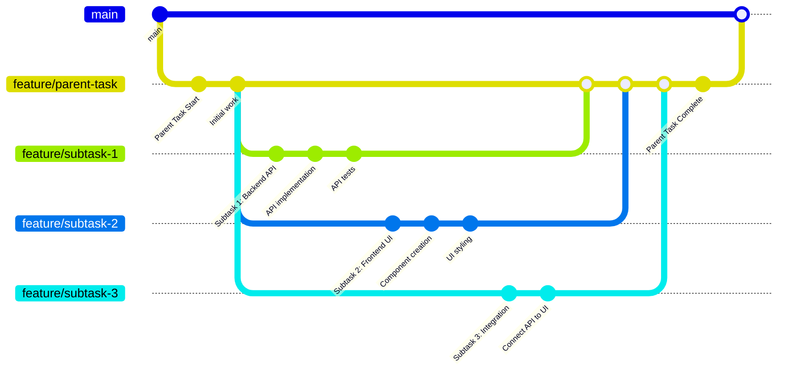

Subtasks allow you to break down complex tasks into smaller, more manageable pieces. Each subtask is linked to a specific task attempt and inherits the same project and branch context.

## Creating Subtasks

<Frame>

</Frame>

To create a subtask from an existing task attempt:

<Steps>
<Step title="Navigate to the task attempt">
  Open the task you want to create subtasks for.
</Step>

<Step title="Click Create Subtask">
  Click the triple dot icon in the top right of the task, then select **Create Subtask**.
</Step>

<Step title="Fill in subtask details">
  The task creation dialog opens with the parent task attempt and base branch automatically set. Add your subtask title and description.
</Step>

<Step title="Save the subtask">
  Click **Save** to create the subtask. It will appear as a new task on your kanban board.
</Step>
</Steps>

<Note>
When you create a subtask, it automatically inherits the base branch from its parent task attempt, ensuring consistency in your development workflow.
</Note>

## Viewing Tasks with Subtasks

<Frame>

</Frame>

When viewing a parent task, you can see its subtasks in the **Task Relationships** panel. This collapsible section shows:

- **Child Tasks** with a count (e.g., "CHILD TASKS (1)")
- Individual subtask titles with links to view them
- Easy navigation between parent and child tasks

This helps you track progress across all related work items and understand the task hierarchy at a glance.

## Viewing Subtask Details

<Frame>

</Frame>

When viewing a subtask, the **Task Relationships** panel displays:

- **Parent Task** section showing the parent task title
- Direct link to navigate to the parent task
- Clear visual indication that this is a child task
- Context about the parent-child relationship

The subtask also shows its own **Create Subtask** button, allowing you to create nested subtasks if needed.

## How Subtasks Work

Subtasks in Vibe Kanban follow these key principles:

### Git Branching Workflow

Subtasks create their own feature branches that can work independently while maintaining connection to the parent task:

### Parent-Child Relationships

- Subtasks are linked to specific **task attempts**, not just tasks
- Each subtask knows which attempt created it
- Multiple subtasks can be created from the same parent attempt

### Branch Inheritance

- Subtasks automatically inherit the base branch from their parent attempt
- This ensures subtasks work within the same development context
- You can modify the branch when creating the subtask if needed

### Independent Task Lifecycle

- Subtasks appear as regular tasks on your kanban board
- Each subtask has its own lifecycle (To do → In Progress → In Review → Done)
- Subtasks can have their own task attempts and coding agents
