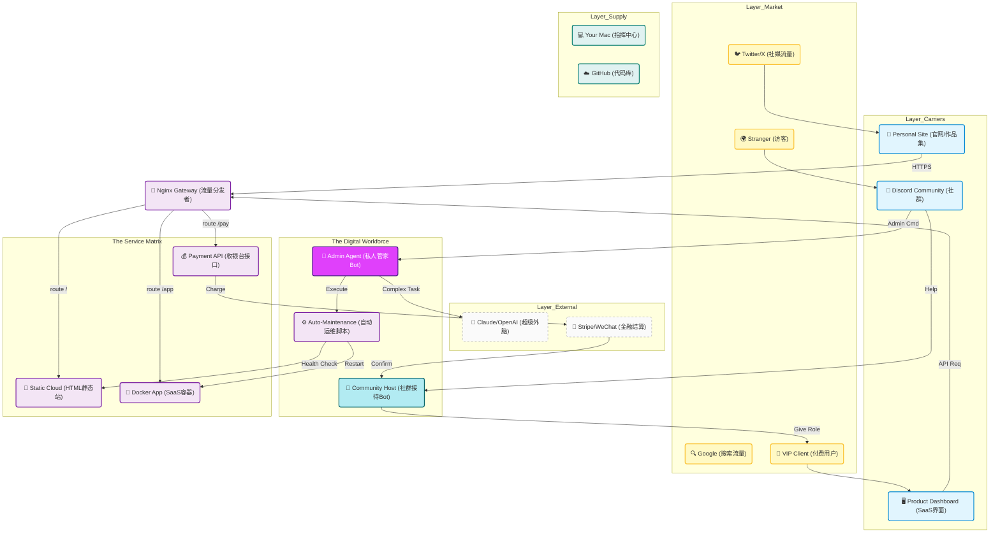
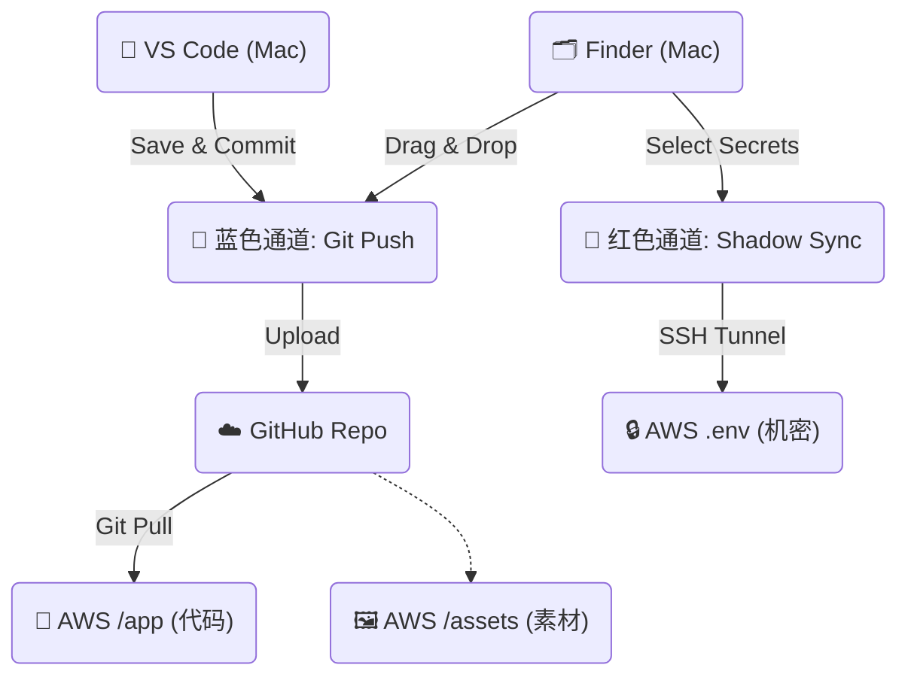

# 🦅 协议核心·最高机密操作手册 (Top Secret Operations Manual)

> **⚠️ Security Classification: EYES ONLY**
> 本文档包含商业帝国的核心蓝图、后勤补给线协议以及对外服务的最底层逻辑。
> 它已被 `.gitignore` 屏蔽，永远不会上传到 GitHub 公共仓库。只有你的本地 Mac 和加密备份可见。

---

## 一、上帝视角 (The Master Vision)
*你的数字帝国是如何运转的。*

这张 [留声图] 展示了从公网流量进入，经过你的层层自动化处理，最终转化为商业价值的全过程。



---

## 二、后勤补给线 (The Supply Chain)
*如何从本地 Mac 安全地向服务器空投物资。*

这是一个双通道系统。千万不要搞混，否则你的私钥就会在 GitHub 上裸奔。



### 🔴 红色通道 (机密文件)
**不要**通过 VS Code 或 GitHub 传输这些文件。它们通过加密的 SSH 隧道直接点对点传输。

*   **适用对象**: `.env`, `SECRET_Key_Vault.md`, 财务数据, 人脉数据库。
*   **发送指令**: `bash integrations/aws/shadow_sync_up.sh`
*   **接收指令**: `bash integrations/aws/shadow_sync_down.sh`

### 🔵 蓝色通道 (公开代码)
标准的 Git 流程。

*   **适用对象**: Python 脚本, HTML 网页, 图片, 核心写作文档。
*   **操作**: VS Code -> Sync Changes。
*   **服务器操作**: 登录服务器 -> `cd ~/xiu-he` -> `git pull`。

---

## 三、对外服务模型 (Service Model)
*如何把你的一身本领变成产品，让别人（女朋友、客户）使用？*

### 3.1 给"自己人" (如女朋友/合伙人)
**目标**: 让他们能够调用你的 AI 能力（写文案、查资料），但不让他们碰底层代码。

1.  **入口**: Discord 服务器 "High Orbit" (高层频道)。
2.  **权限**:
    *   在 Discord 里，给她分配 `🔴 架构师` (Architect) 或 `🟠 管理员` (Admin) 身份。
    *   **不要** 给她 AWS 的 SSH Key。
3.  **她能做什么**:
    *   在 Discord 里 @AdminBot 说："帮我写一封给客户的邮件，语气要强硬。"
    *   Bot 会调用你的 `Asher_Profile` (你的思维方式) + `Claude` (智力) 生成内容，直接回复给她。
    *   她觉得就像在和你对话一样，但其实是你的数字分身在工作。

### 3.2 给"客户/用户" (SaaS 模式)
**目标**: 让他们付费使用你的工具 (如 Vibe Kanban, Asyre Web)。

1.  **入口**: 你的域名 (例如 `app.yixuan.com` 或 `asyre.ai`)。
2.  **流程**:
    *   用户访问网页 -> 注册/登录。
    *   点击 "Upgrade" -> 跳转 Stripe/微信支付。
    *   支付成功 -> WebHook 通知服务器 -> 数据库更新字段 `is_vip = true`。
    *   用户解锁高级功能 (如无限制 AI 生成)。

---

## 四、基础设施搭建实操 (Infrastructure Guide)

### 4.1 Nginx 网关配置 (流量分发)
如何在只有一台服务器的情况下，同时跑官网、SaaS 和 API？
答案是 **Nginx 反向代理**。

**配置文件路径**: `/etc/nginx/sites-available/default` (在服务器上)

**核心配置逻辑**:
```nginx
# 1. 官网 (yixuan.com)
server {
    server_name yixuan.com;
    location / {
        root /home/ubuntu/xiu-he/Content/Web; # 你的静态网页文件夹
        index index.html;
    }
}

# 2. Asyre SaaS (app.yixuan.com)
server {
    server_name app.yixuan.com;
    location / {
        proxy_pass http://localhost:3000; # 转发给 Docker 容器
    }
}

# 3. 支付接口 (api.yixuan.com)
server {
    server_name api.yixuan.com;
    location / {
        proxy_pass http://localhost:8000; # 转发给 Python 后端
    }
}
```

### 4.2 Docker 容器化部署 (SaaS 部署)
以后你写了新产品（比如一个新的 AI 工具），怎么丢上去？

1.  **本地开发**: 写好代码，写好 `Dockerfile`。
2.  **本地构建**: `docker build -t my-new-app .`
3.  **上传**: 
    *   如果是开源的: `git push`
    *   如果是闭源的: 通过 Docker Hub 或者直接把镜像保存成文件传上去 (进阶)。
    *   **推荐**: 代码通过 `git push` 上去，在服务器上现场 build。
4.  **服务器运行**:
    ```bash
    cd ~/xiu-he/Projects/NewApp
    docker-compose up -d --build
    ```
    (它就会在后台静默运行了，哪怕你断开 SSH 它也在跑)

---

## 五、紧急维护协议 (Emergency Protocols)

### 5.1 如果服务器挂了 (Server Down)
1.  **登录 AWS 控制台 (Lightsail)**。
2.  点击 "Reboot" (重启) 按钮。
3.  等 2 分钟。
4.  SSH 连上去，运行检查脚本: `python3 integrations/discord-bot/setup_server.py`。

### 5.2 如果私钥泄露 (Key Compromise)
1.  **立即** 在 AWS 控制台把那个 Key Pair 删掉。
2.  生成新的 Key Pair。
3.  更新本地的 `ssh_config`。
4.  更新 `shadow_sync` 脚本里的路径。

---

> **Final Note**: 
> 这份文档是你数字领土的宪法。
> 随着你的帝国扩张（增加更多服务器、更多 SaaS），请不断更新这里的架构图和端口表。
> **Keep it Secret. Keep it Safe.**
